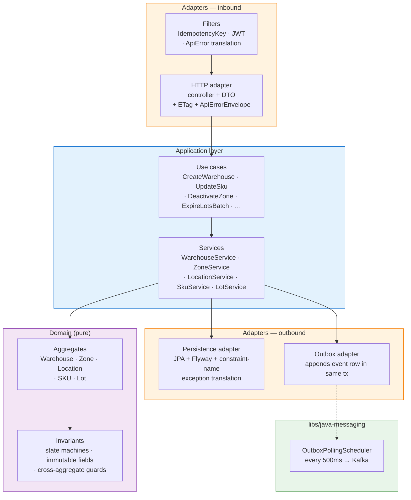
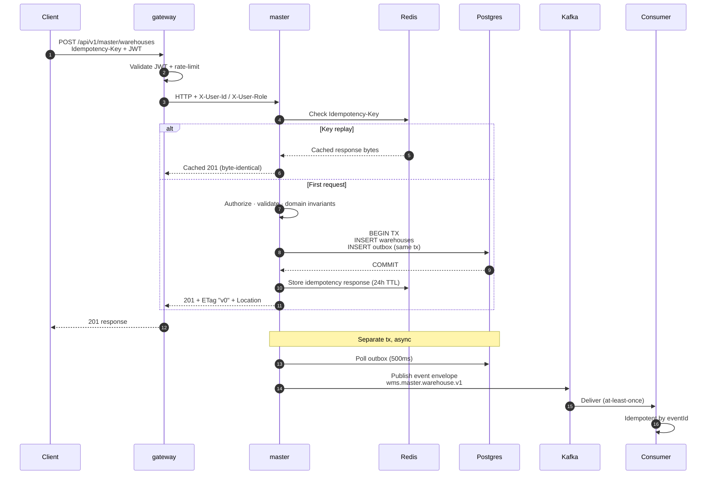

# wms-platform

[](https://github.com/kanggle/wms-platform/actions/workflows/ci.yml?query=branch%3Amain)

> **Warehouse Management System backend** — production-oriented, spec-driven, AI-assisted

Spring Boot 3 microservices for a warehouse's master-data and ingress path. Built as a portfolio project, engineered to production standards: hexagonal architecture, transactional outbox, idempotency keys, JWT + rate limiting, contract harness, live-pair end-to-end tests.

---

## 📍 Status — master-service v1 complete

| Aggregate | Production | Tests (unit/slice/H2/Testcontainers) | Events | Contract harness |
|---|---|---|---|---|
| **Warehouse** | ✅ | ✅ | ✅ | ✅ |
| **Zone** | ✅ | ✅ | ✅ | ✅ |
| **Location** | ✅ | ✅ | ✅ | ✅ |
| **SKU** | ✅ | ✅ | ✅ | ✅ |
| **Lot** | ✅ | ✅ | ✅ | ✅ |
| Partner | deferred (Lot's `supplierPartnerId` soft-validated) | — | — | — |

**Platform baseline**:
- Gateway: Spring Cloud Gateway · JWT (OAuth2 Resource Server) · Redis rate-limit (`{ip,routeId}` compound key, fail-open decorator) · JWT header enrichment
- Master: Hexagonal (ports & adapters) · Flyway + Postgres · Transactional outbox → Kafka · Idempotency-Key filter · PSQLException constraint-name translation
- Ops: Actuator `metrics` (profile-scoped) · Outbox publisher backpressure gauges · Lot expiration scheduler (daily cron)
- Testing: `@WebMvcTest` slices · H2 fast tests · Testcontainers Postgres/Kafka/Redis · JSON Schema contract harness (HTTP + events) · gateway↔master live-pair e2e (5 scenarios)

---

## 🏛️ Architecture

### System view

```mermaid
flowchart LR
    Client(["Client<br/>(web · mobile · ERP)"])

    subgraph Edge["Edge"]
        GW["gateway-service<br/>:8080<br/><br/>• JWT validate<br/>• rate-limit<br/>  (ip,routeId) fail-open<br/>• header enrich<br/>  X-User-Id, X-User-Role"]
    end

    subgraph App["Application"]
        MS["master-service<br/>:8081<br/><br/>• Hexagonal<br/>• Idempotency filter<br/>• Outbox publisher<br/>• Lot expiry scheduler"]
    end

    subgraph Infra["Infrastructure"]
        PG[("Postgres 16<br/>master DB + outbox")]
        KF[["Kafka (KRaft)<br/>wms.master.*.v1"]]
        RD[("Redis<br/>idempotency +<br/>rate-limit counters")]
    end

    Consumer(["Event Consumers<br/>inventory · notification<br/>· admin · future ERP"])

    Client -->|HTTPS| GW
    GW -->|"HTTP + JWT<br/>+ X-User-*"| MS
    GW -.->|session<br/>rate-limit| RD
    MS -->|JPA| PG
    MS -.->|Idempotency-Key<br/>cache| RD
    MS -->|outbox row<br/>(same tx)| PG
    PG -->|polling| MS
    MS -->|publish| KF
    KF --> Consumer

    style Client fill:#e1f5ff,stroke:#0288d1
    style Consumer fill:#e1f5ff,stroke:#0288d1
    style GW fill:#fff3e0,stroke:#f57c00
    style MS fill:#f3e5f5,stroke:#7b1fa2
    style PG fill:#e8f5e9,stroke:#388e3c
    style KF fill:#e8f5e9,stroke:#388e3c
    style RD fill:#e8f5e9,stroke:#388e3c
```

### Master-service internal — Hexagonal



### Mutation flow (POST / PATCH / deactivate)



---

### Services

| Service | Service Type | Responsibility | v1 Status |
|---|---|---|---|
| `gateway-service` | `rest-api` | External routing, JWT validation, rate limiting, header enrichment | ✅ |
| `master-service` | `rest-api` | Master data: warehouses, zones, locations, SKUs, lots | ✅ |
| `inbound-service` | `rest-api` | ASN management, inspection, putaway | scaffold |
| `inventory-service` | `rest-api` | Location-based inventory, transfers, adjustments | scaffold |
| `outbound-service` | `rest-api` | Outbound orders, picking, packing, shipping | scaffold |
| `notification-service` | `event-consumer` | Kafka consumer for operational alerts (Slack, email) | scaffold |
| `admin-service` | `rest-api` | Dashboards, KPIs, user/permission management | scaffold |

Each service declares its own internal architecture in `specs/services/<service>/architecture.md`. Write-heavy services (master / inventory / inbound / outbound) use **Hexagonal (Ports & Adapters)**. Gateway is Layered.

### Bounded Contexts (per `rules/domains/wms.md`)

- **Master Data** — warehouse, zone, location, SKU, partner, lot (v1 implemented; partner deferred)
- **Inbound** — ASN, inspection, putaway
- **Inventory** — location-based stock, transfers, adjustments
- **Outbound** — orders, picking, packing, shipping
- **Admin / Operations** — dashboards, KPIs, user management

### Traits applied

- **`transactional`** — mutating paths use `Idempotency-Key`, state machines, optimistic locking, transactional outbox
- **`integration-heavy`** — future ERP / TMS / scanner integrations via dedicated ports, circuit breakers, bulkhead patterns

See [`rules/traits/transactional.md`](rules/traits/transactional.md) and [`rules/traits/integration-heavy.md`](rules/traits/integration-heavy.md).

---

## 🛠️ Tech Stack

- **Language**: Java 21
- **Framework**: Spring Boot 3.4
- **Build**: Gradle 8.14 (multi-module)
- **Persistence**: PostgreSQL 16 + Flyway (per-service DB; no shared DB)
- **Messaging**: Apache Kafka (KRaft mode, transactional outbox)
- **Cache**: Redis (idempotency key storage, rate limit counters)
- **Observability**: Micrometer + Actuator (Prometheus-ready)
- **Test**: JUnit 5 · AssertJ · Testcontainers · JSON Schema (networknt) · Nimbus JOSE JWT (JWKS stand-in) · MockWebServer
- **Local dev**: Docker Compose

---

## 🚀 Getting Started

### Prerequisites

- Java 21 (Temurin recommended)
- Docker (for Testcontainers and the local stack)

### Boot the local stack

```bash
cp .env.example .env    # fill in values
docker-compose up -d    # Postgres, Kafka, Redis
```

### Run a service

```bash
# master-service on :8081, gateway-service on :8080
./gradlew :apps:master-service:bootRun
./gradlew :apps:gateway-service:bootRun
```

### Run tests

```bash
./gradlew :apps:master-service:check       # unit + slice + H2 + Testcontainers
./gradlew :apps:gateway-service:check
./gradlew check                             # everything
```

**Testcontainers on Windows**: run tests from WSL2 (Ubuntu + Docker Desktop WSL integration). Windows-native test runs skip Testcontainers via `@Testcontainers(disabledWithoutDocker = true)`.

---

## 📁 Directory Structure

```
wms-platform/
├── PROJECT.md              ← domain=wms, traits=[transactional, integration-heavy]
├── README.md               ← this file
├── CLAUDE.md               ← rule-driven development instructions
├── TEMPLATE.md              ← framework extraction guide (for reuse across projects)
├── build.gradle            ← root Gradle config (plugins + subprojects)
├── settings.gradle         ← module composition
├── docker-compose.yml      ← local stack
├── .github/workflows/      ← GitHub Actions (check + boot-jar artifacts + e2e job)
│
├── libs/                   ← shared libraries (project-agnostic)
│   ├── java-common/        ← base types, exceptions
│   ├── java-messaging/     ← outbox publisher, event envelope, Kafka abstractions
│   ├── java-observability/ ← Micrometer setup, logging
│   ├── java-security/      ← JWT validation, OAuth2 setup
│   ├── java-test-support/
│   └── java-web/
├── platform/               ← platform-level policies (error handling, testing strategy, service types)
├── rules/                  ← rule taxonomy (common + domains/wms + traits)
├── .claude/                ← AI agent config: skills/, agents/, commands/, config/
│
├── apps/                   ← service modules
│   ├── gateway-service/
│   ├── master-service/
│   ├── inbound-service/    ← scaffold
│   ├── inventory-service/  ← scaffold
│   ├── outbound-service/   ← scaffold
│   ├── notification-service/  ← scaffold
│   └── admin-service/      ← scaffold
│
├── specs/
│   ├── contracts/
│   │   ├── http/master-service-api.md
│   │   └── events/master-events.md
│   ├── services/
│   │   └── master-service/ ← architecture, domain-model, idempotency
│   ├── features/
│   └── use-cases/
├── tasks/
│   ├── INDEX.md            ← lifecycle rules
│   ├── templates/          ← task templates (shared)
│   └── done/               ← 19 tasks from v1 development
├── knowledge/
│   └── adr/                ← architecture decision records
├── docs/                   ← operational docs + shared guides
├── infra/                  ← Prometheus, Grafana, Loki configs
└── docker/                 ← Docker build contexts (DB init, etc.)
```

---

## 📐 Key Design Decisions

### v1 Entity Scope (Master Data)

5 aggregates implemented: **Warehouse · Zone · Location · SKU · Lot**. Partner deferred (Lot's `supplierPartnerId` is soft-validated in v1). Common fields (`id`, `*_code`, `name`, `status`, `version`, timestamps, actor ids). Soft deactivation only (no hard deletes in v1). Details: [specs/services/master-service/domain-model.md](specs/services/master-service/domain-model.md).

### Cross-Aggregate Invariants (the interesting one)

Lot requires its parent SKU to have `trackingType == LOT` AND `status == ACTIVE`. Conversely, SKU deactivation is blocked while active Lots exist under it (`REFERENCE_INTEGRITY_VIOLATION` 409). Zone deactivation is blocked while active Locations exist. Warehouse deactivation is blocked while active Zones exist. Each guard is a port method (`hasActive*For(...)`) implemented as a real JPA `existsBy*AndStatus` query — not a stub.

### Hexagonal Architecture for Write-Heavy Services

Master uses Hexagonal to isolate domain logic from infrastructure. Gateway is Layered (no rich domain). Rationale: external integration variety (ERP, TMS, scanners) matches the Ports & Adapters metaphor naturally. Details: [specs/services/master-service/architecture.md](specs/services/master-service/architecture.md).

### Transactional Outbox for Event Publication

Every state change writes an outbox row in the same DB transaction; a separate publisher (`OutboxPollingScheduler` in `libs/java-messaging`) forwards rows to Kafka. Guarantees exactly-one publish per committed change. At-least-once delivery; consumers must be idempotent keyed by `eventId`.

### Error Envelope with `timestamp`

All error responses carry `{code, message, timestamp}` (ISO 8601 UTC) per `platform/error-handling.md`. `STATE_TRANSITION_INVALID` → 422 (unprocessable business rule). `REFERENCE_INTEGRITY_VIOLATION` → 409. `IMMUTABLE_FIELD` attempts → 422. Version conflicts → 409. Schema validated by `HttpContractTest` / `EventContractTest` via JSON Schema.

### Idempotency-Key on All Mutating Endpoints

Client-supplied UUID + method + path scope. Redis-backed storage with 24h TTL. Fail-closed on Redis outage (503). Details: [specs/services/master-service/idempotency.md](specs/services/master-service/idempotency.md).

### Gateway Rate-Limit — Compound Key + Fail-Open

Key is `{clientIp}:{routeId}` (not IP-only — future `/inventory/**` route won't share master's bucket). `FailOpenRateLimiter` decorator wraps `RedisRateLimiter`: Redis unavailable → request passes + WARN log (per `platform/api-gateway-policy.md`).

### Local-Only Referential Integrity (v1)

Master-service checks only its own child records on deactivation. Cross-service inventory / order references are out of scope for v1 (would require a `deactivation.requested` saga). Known limitation, documented in the contract.

---

## 🧭 How this was built

This project follows a rule-driven, task-centric workflow assisted by **[Claude Code](https://claude.com/claude-code)**:

- **Specs first**: contracts, architecture, and domain model authored before any implementation.
- **Taxonomy-activated rules**: `PROJECT.md` declares `domain=wms, traits=[transactional, integration-heavy]`. The AI loads `rules/common.md` + `rules/domains/wms.md` + `rules/traits/*` for each declared trait — no other rules consulted.
- **Skills + agents**: 80+ reusable skills under `.claude/skills/` (Hexagonal structure, outbox pattern, idempotent consumer, testing strategy, etc.) and specialized subagents (`architect`, `backend-engineer`, `code-reviewer`, `qa-engineer`, `api-designer`) in `.claude/agents/`.
- **Task lifecycle**: `ready → in-progress → review → done`. Only `tasks/ready/` items are implemented. Every task goes through Plan → Implement → Test → Review.
- **/process-tasks**: the top-level pipeline command — batch-implements everything in `ready/` via worktree-isolated subagents, then parallel-reviews everything in `review/`.
- **Review discipline**: every implementation gets an independent review pass. Review outcomes are `APPROVE` or `FIX NEEDED` → new fix ticket. All recorded in `tasks/INDEX.md` with verdict + follow-up.

The full development history (60+ commits across 19 completed tasks) lives at **[kanggle/monorepo-lab](https://github.com/kanggle/monorepo-lab)** — this repo is a snapshot extracted from there via `scripts/sync-portfolio.sh`.

---

## 🔗 Related

- **Development workspace**: [kanggle/monorepo-lab](https://github.com/kanggle/monorepo-lab) — where tasks are authored, reviewed, and merged
- **Portfolio hub**: [github.com/kanggle](https://github.com/kanggle) — other projects

### Specs (in this repo)

- [PROJECT.md](PROJECT.md) — domain/traits declaration, service map, out-of-scope list
- [specs/services/master-service/architecture.md](specs/services/master-service/architecture.md)
- [specs/services/master-service/domain-model.md](specs/services/master-service/domain-model.md)
- [specs/services/master-service/idempotency.md](specs/services/master-service/idempotency.md)
- [specs/contracts/http/master-service-api.md](specs/contracts/http/master-service-api.md)
- [specs/contracts/events/master-events.md](specs/contracts/events/master-events.md)

### Rules

- [rules/common.md](rules/common.md) — always-loaded rule index
- [rules/domains/wms.md](rules/domains/wms.md) — WMS domain rules (W1–W6)
- [rules/traits/transactional.md](rules/traits/transactional.md) — T1–T8
- [rules/traits/integration-heavy.md](rules/traits/integration-heavy.md) — I1–I10

---

## 📄 License

License pending. Not open source at this time.
