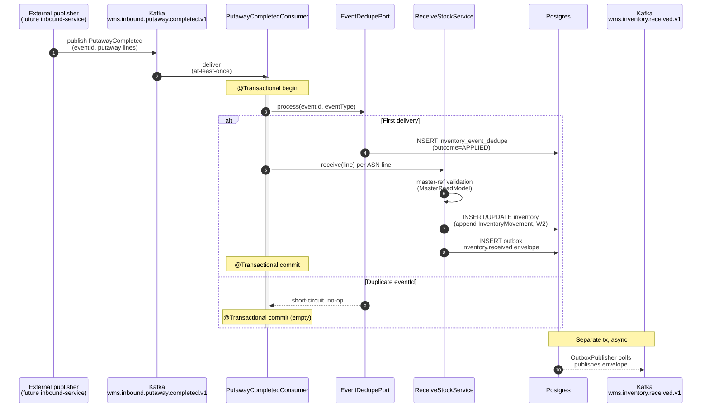
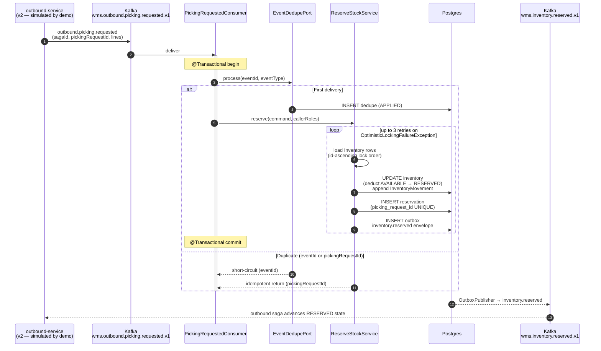
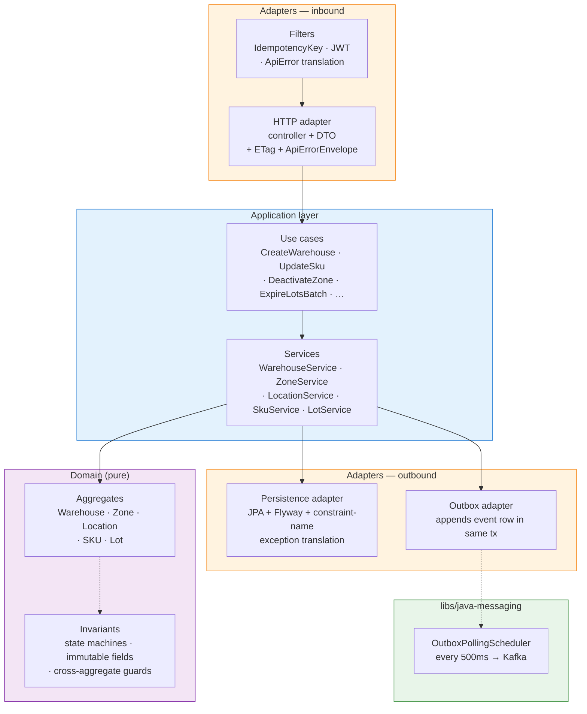
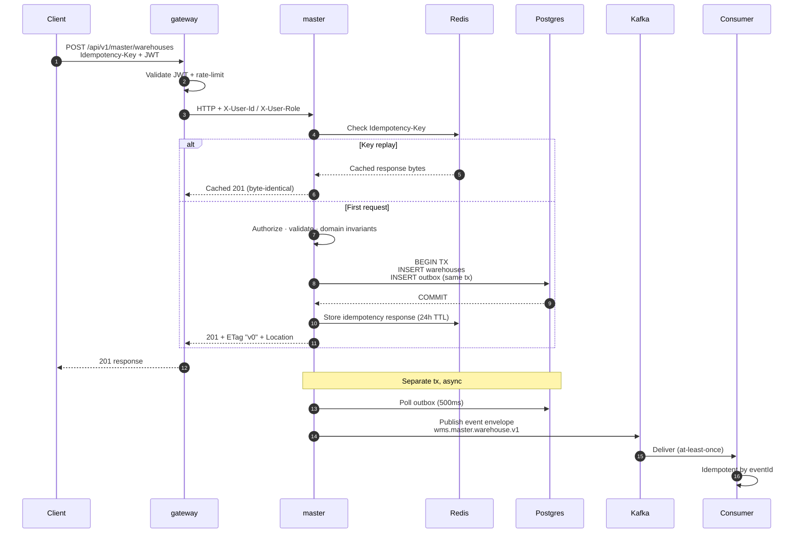

# wms-platform

[](https://github.com/kanggle/wms-platform/actions/workflows/ci.yml?query=branch%3Amain)

> **Warehouse Management System backend** — production-oriented, spec-driven, AI-assisted

Spring Boot 3 microservices: master data, inventory mutation, and an edge gateway for a warehouse's authoritative system of record. Built as a portfolio project, engineered to production standards: hexagonal architecture, transactional outbox, two-phase reservation, idempotency keys, JWT + rate limiting, contract harness, live-pair end-to-end tests.

> **What's intentionally v2** — `inbound`, `outbound`, `admin` services are fully designed (`specs/services/<name>/`) but not implemented. See [Scope-honest v1](#-scope-honest-v1) — depth over breadth was a deliberate choice.

---

## 📍 Status — v1: master + inventory + gateway

### master-service

| Aggregate | Production | Tests (unit/slice/H2/Testcontainers) | Events | Contract harness |
|---|---|---|---|---|
| **Warehouse** | ✅ | ✅ | ✅ | ✅ |
| **Zone** | ✅ | ✅ | ✅ | ✅ |
| **Location** | ✅ | ✅ | ✅ | ✅ |
| **SKU** | ✅ | ✅ | ✅ | ✅ |
| **Lot** | ✅ | ✅ | ✅ | ✅ |
| Partner | deferred (Lot's `supplierPartnerId` soft-validated) | — | — | — |

### inventory-service

| Aggregate / Capability | Production | Tests | Events |
|---|---|---|---|
| `Inventory` + `InventoryMovement` (W2 append-only ledger) | ✅ | ✅ | `inventory.received` |
| `Reservation` — W4/W5 two-phase, state machine `RESERVED → CONFIRMED / RELEASED` | ✅ | ✅ | `inventory.reserved` · `.released` · `.confirmed` |
| `StockAdjustment` — REGULAR · MARK_DAMAGED · WRITE_OFF_DAMAGED | ✅ | ✅ | `inventory.adjusted` |
| `StockTransfer` — W1 atomic id-ascending lock order | ✅ | ✅ | `inventory.transferred` |
| `LowStockDetection` — threshold + 1h Redis SETNX debounce, fail-open | ✅ | ✅ | `inventory.low-stock-detected` |
| Outbound-saga consumers (PickingRequested · PickingCancelled · ShippingConfirmed · PutawayCompleted) | ✅ | ✅ | (inbound; eventId dedupe in same TX) |

### gateway-service

JWT validation · Redis rate-limit (`{ip, routeId}` compound, fail-open decorator) · header enrichment (`X-User-Id`, `X-User-Role`) · live-pair e2e against master.

---

## Platform baseline

- **Hexagonal everywhere except gateway** — domain free of Spring/JPA. Gateway is Layered (no rich domain).
- **Transactional outbox** — every state change writes an outbox row in the same DB tx; `OutboxPublisher` (`@Scheduled`, exp backoff + jitter) forwards to Kafka with `pending`/`lag.seconds`/`failure.count` metrics.
- **eventId dedupe on every consumer** — `inventory_event_dedupe(event_id, outcome)` written via `Propagation.MANDATORY` in the same TX as the domain effect. Layered with aggregate-state short-circuits as inner guard.
- **Idempotency-Key filter** — Redis-backed (24h TTL); replay returns byte-identical cached response. Storage key conformant to `idempotency.md`.
- **Optimistic-lock retry with id-ascending lock order** — `ReserveStockService` retries up to 3× with 100–300ms jitter on `OptimisticLockingFailureException`; multi-row locks taken in id-ascending order.
- **Authorization in the application layer** — services receive caller roles via the command record (`Set<String> callerRoles`); controllers populate from `Authentication.getAuthorities()`. No `SecurityContextHolder` reach-back inside services.
- **Schedulers** — Lot expiration (daily cron, master) · `ReservationExpiryJob` (`@Scheduled` per-row TX boundary, inventory).
- **Testing** — `@WebMvcTest` slices · H2 fast tests · Testcontainers (Postgres / Kafka / Redis) · JSON Schema contract harness · gateway↔master live-pair e2e (5 scenarios) · 122-test inventory-service unit suite.

---

## 🏛️ Architecture

### System view (v1)

```mermaid
flowchart LR
    Client(["Client<br/>(web · mobile · ERP)"])

    subgraph Edge["Edge"]
        GW["gateway-service<br/>:8080<br/><br/>• JWT validate<br/>• rate-limit<br/>  (ip,routeId) fail-open<br/>• header enrich"]
    end

    subgraph App["Application"]
        MS["master-service<br/>:8081<br/><br/>• Hexagonal<br/>• Idempotency filter<br/>• Lot expiry sched"]
        IS["inventory-service<br/>:8082<br/><br/>• Hexagonal<br/>• 4 outbound-saga<br/>  consumers<br/>• Reservation TTL job<br/>• Low-stock detector"]
    end

    subgraph Infra["Infrastructure"]
        PG[("Postgres 16<br/>per-service DB +<br/>outbox + dedupe")]
        KF[["Kafka (KRaft)<br/>wms.master.*.v1<br/>wms.inventory.*.v1"]]
        RD[("Redis<br/>idempotency<br/>rate-limit<br/>low-stock debounce")]
    end

    subgraph V2["📐 v2 — specs only"]
        IB["inbound-service"]
        OB["outbound-service"]
        AD["admin-service"]
    end

    Client -->|HTTPS| GW
    GW -->|JWT + X-User-*| MS
    GW -->|JWT + X-User-*| IS
    GW -.-> RD
    MS --> PG
    IS --> PG
    MS -.-> RD
    IS -.-> RD
    MS -->|outbox| PG
    IS -->|outbox| PG
    MS -->|publish| KF
    IS -->|publish| KF
    KF -->|consume<br/>(eventId dedupe)| IS

    KF -.-> V2

    style Client fill:#e1f5ff,stroke:#0288d1
    style GW fill:#fff3e0,stroke:#f57c00
    style MS fill:#f3e5f5,stroke:#7b1fa2
    style IS fill:#e3f2fd,stroke:#1976d2
    style PG fill:#e8f5e9,stroke:#388e3c
    style KF fill:#e8f5e9,stroke:#388e3c
    style RD fill:#e8f5e9,stroke:#388e3c
    style V2 fill:#f5f5f5,stroke:#9e9e9e,stroke-dasharray:5 5
    style IB fill:#fafafa,stroke:#bdbdbd
    style OB fill:#fafafa,stroke:#bdbdbd
    style AD fill:#fafafa,stroke:#bdbdbd
```

### Putaway → `inventory.received` (cross-service event flow)



### Picking saga participation — `outbound.picking.requested` → reserve → `inventory.reserved`



### Master-service internal — Hexagonal



### Mutation flow (POST / PATCH / deactivate)



---

### Services

| Service | Service Type | Responsibility | v1 Status |
|---|---|---|---|
| `gateway-service` | `rest-api` | External routing, JWT validation, rate limiting, header enrichment | ✅ implemented |
| `master-service` | `rest-api` | Master data: warehouses, zones, locations, SKUs, lots | ✅ implemented |
| `inventory-service` | `rest-api` + `event-consumer` | Location-based stock; W4/W5 reservations; adjustments / transfers / low-stock alerts; outbound-saga participation | ✅ implemented |
| `inbound-service` | `rest-api` | ASN management, inspection, putaway | 📐 specs only — v2 |
| `outbound-service` | `rest-api` + `event-consumer` (saga orchestrator) | Outbound orders, picking, packing, shipping; outbound saga | 📐 specs only — v2 |
| `admin-service` | `rest-api` + `event-consumer` (CQRS read-model) | Dashboards, KPIs, user/permission management | 📐 specs only — v2 |

Each service declares its own internal architecture in `specs/services/<service>/architecture.md`. Write-heavy services (master / inventory / inbound / outbound) use **Hexagonal (Ports & Adapters)**. Gateway and admin are Layered (admin is a documented `## Overrides` since it is read-side / CQRS-shaped — see `specs/services/admin-service/architecture.md`).

### Bounded Contexts (per `rules/domains/wms.md`)

- **Master Data** — warehouse, zone, location, SKU, partner, lot (v1 implemented; partner deferred)
- **Inbound** — ASN, inspection, putaway
- **Inventory** — location-based stock, transfers, adjustments
- **Outbound** — orders, picking, packing, shipping
- **Admin / Operations** — dashboards, KPIs, user management

### Traits applied

- **`transactional`** — mutating paths use `Idempotency-Key`, state machines, optimistic locking, transactional outbox
- **`integration-heavy`** — future ERP / TMS / scanner integrations via dedicated ports, circuit breakers, bulkhead patterns

See [`rules/traits/transactional.md`](rules/traits/transactional.md) and [`rules/traits/integration-heavy.md`](rules/traits/integration-heavy.md).

---

## 🛠️ Tech Stack

- **Language**: Java 21
- **Framework**: Spring Boot 3.4
- **Build**: Gradle 8.14 (multi-module)
- **Persistence**: PostgreSQL 16 + Flyway (per-service DB; no shared DB)
- **Messaging**: Apache Kafka (KRaft mode, transactional outbox)
- **Cache**: Redis (idempotency key storage, rate limit counters)
- **Observability**: Micrometer + Actuator (Prometheus-ready)
- **Test**: JUnit 5 · AssertJ · Testcontainers · JSON Schema (networknt) · Nimbus JOSE JWT (JWKS stand-in) · MockWebServer
- **Local dev**: Docker Compose

---

## 🚀 Getting Started

### Prerequisites

- Java 21 (Temurin recommended)
- Docker (for Testcontainers and the local stack)

### Boot the local stack

```bash
cp .env.example .env    # fill in values
docker-compose up -d    # Postgres, Kafka, Redis
```

### Run a service

```bash
# Default ports: gateway :8080, master :8081, inventory :8082
./gradlew :apps:gateway-service:bootRun
./gradlew :apps:master-service:bootRun
./gradlew :apps:inventory-service:bootRun
```

> **Cross-project port namespace** — services use `${PORT_PREFIX:-2}XXXX`; `2` is the WMS prefix, allowing parallel runs alongside other portfolio projects (e.g., `1` = ecommerce). Override via env var when running multiple platforms locally.

### Run tests

```bash
./gradlew :apps:master-service:check       # unit + slice + H2 + Testcontainers
./gradlew :apps:inventory-service:check    # unit + slice + Testcontainers (Postgres/Kafka/Redis)
./gradlew :apps:gateway-service:check
./gradlew check                             # everything
```

**Testcontainers on Windows**: run tests from WSL2 (Ubuntu + Docker Desktop WSL integration). Windows-native test runs skip Testcontainers via `@Testcontainers(disabledWithoutDocker = true)`.

---

## 🎯 Demo — golden-path E2E with curl

The flow exercises master-data setup, the **putaway-completed → inventory.received** consumer path (simulating a future inbound-service publisher), and the **W4/W5 reservation lifecycle**. Run after `docker compose up -d`.

```bash
# Boot stack + services
docker compose up -d                          # postgres, kafka, redis
./gradlew :apps:gateway-service:bootRun &     # :20080
./gradlew :apps:master-service:bootRun &      # :20081
./gradlew :apps:inventory-service:bootRun &   # :20082

# Resolve a JWT (configure your IdP or use the seed token from infra/seed-token.txt)
TOKEN=$(cat infra/seed-token.txt)
H_AUTH="-H Authorization: Bearer $TOKEN"
H_IDEM(){ echo "-H Idempotency-Key: $(uuidgen)"; }
H_JSON="-H Content-Type: application/json"

# 1) Create warehouse → POST /api/v1/master/warehouses
WH=$(curl -s $H_AUTH $H_JSON $(H_IDEM) -X POST http://localhost:20080/api/v1/master/warehouses \
  -d '{"code":"WH-001","name":"Seoul DC","status":"ACTIVE"}' | jq -r .id)

# 2) Create zone, location, SKU (similar; see specs/contracts/http/master-service-api.md)
# ... (omitted for brevity)

# 3) Simulate inbound-service publishing wms.inbound.putaway.completed.v1
docker exec wms-kafka kafka-console-producer \
  --bootstrap-server localhost:9092 \
  --topic wms.inbound.putaway.completed.v1 < demo/putaway-completed.json
# inventory-service's PutawayCompletedConsumer picks up, calls ReceiveStockUseCase,
# writes Inventory + InventoryMovement (W2 ledger), emits inventory.received via outbox.

# 4) Query inventory → GET /api/v1/inventory
curl -s $H_AUTH "http://localhost:20080/api/v1/inventory?warehouseId=$WH" | jq

# 5) Reserve stock → POST /api/v1/reservations (W4: AVAILABLE → RESERVED)
RESV=$(curl -s $H_AUTH $H_JSON $(H_IDEM) -X POST http://localhost:20080/api/v1/reservations \
  -d "$(cat demo/reserve-request.json)" | jq -r .id)

# 6) Confirm shipping (W5: consume RESERVED, AVAILABLE untouched)
curl -s $H_AUTH $H_JSON $(H_IDEM) -X POST \
  "http://localhost:20080/api/v1/reservations/$RESV/confirm" \
  -d "$(cat demo/confirm-request.json)"

# 7) Verify all 4 events landed on Kafka
docker exec wms-kafka kafka-console-consumer \
  --bootstrap-server localhost:9092 \
  --topic wms.inventory.received.v1,wms.inventory.reserved.v1,wms.inventory.confirmed.v1 \
  --from-beginning --max-messages 3
```

> Demo payload templates live under `demo/` (committed sample JSON for putaway / reserve / confirm). The script is the same flow exercised by `PutawayCompletedConsumerIntegrationTest` and `PickingFlowIntegrationTest` — those Testcontainers tests are the authoritative version.

---

## 📁 Directory Structure

```
wms-platform/
├── PROJECT.md              ← domain=wms, traits=[transactional, integration-heavy]
├── README.md               ← this file
├── CLAUDE.md               ← rule-driven development instructions
├── TEMPLATE.md              ← framework extraction guide (for reuse across projects)
├── build.gradle            ← root Gradle config (plugins + subprojects)
├── settings.gradle         ← module composition
├── docker-compose.yml      ← local stack
├── .github/workflows/      ← GitHub Actions (check + boot-jar artifacts + e2e job)
│
├── libs/                   ← shared libraries (project-agnostic)
│   ├── java-common/        ← base types, exceptions
│   ├── java-messaging/     ← outbox publisher, event envelope, Kafka abstractions
│   ├── java-observability/ ← Micrometer setup, logging
│   ├── java-security/      ← JWT validation, OAuth2 setup
│   ├── java-test-support/
│   └── java-web/
├── platform/               ← platform-level policies (error handling, testing strategy, service types)
├── rules/                  ← rule taxonomy (common + domains/wms + traits)
├── .claude/                ← AI agent config: skills/, agents/, commands/, config/
│
├── apps/                   ← service modules
│   ├── gateway-service/    ← v1 ✅
│   ├── master-service/     ← v1 ✅
│   ├── inventory-service/  ← v1 ✅
│   ├── inbound-service/    ← v2 (specs only)
│   ├── outbound-service/   ← v2 (specs only)
│   └── admin-service/      ← v2 (specs only)
│
├── specs/
│   ├── contracts/
│   │   ├── http/{master,inventory}-service-api.md
│   │   └── events/{master,inventory}-events.md
│   ├── services/
│   │   ├── master-service/    ← architecture, domain-model, idempotency
│   │   ├── inventory-service/ ← architecture, domain-model, idempotency, sagas, state-machines
│   │   ├── inbound-service/   ← architecture, domain-model (v2 — specs ahead of code)
│   │   ├── outbound-service/  ← architecture, domain-model (v2)
│   │   └── admin-service/     ← architecture, domain-model (v2)
│   ├── features/
│   └── use-cases/
├── tasks/
│   ├── INDEX.md            ← lifecycle rules
│   ├── templates/          ← task templates (shared)
│   └── done/               ← 32 tasks from v1 development
├── knowledge/
│   └── adr/                ← architecture decision records
├── docs/                   ← operational docs + shared guides
├── infra/                  ← Prometheus, Grafana, Loki configs
└── docker/                 ← Docker build contexts (DB init, etc.)
```

---

## 📐 Key Design Decisions

### v1 Entity Scope (Master Data)

5 aggregates implemented: **Warehouse · Zone · Location · SKU · Lot**. Partner deferred (Lot's `supplierPartnerId` is soft-validated in v1). Common fields (`id`, `*_code`, `name`, `status`, `version`, timestamps, actor ids). Soft deactivation only (no hard deletes in v1). Details: [specs/services/master-service/domain-model.md](specs/services/master-service/domain-model.md).

### Cross-Aggregate Invariants (the interesting one)

Lot requires its parent SKU to have `trackingType == LOT` AND `status == ACTIVE`. Conversely, SKU deactivation is blocked while active Lots exist under it (`REFERENCE_INTEGRITY_VIOLATION` 409). Zone deactivation is blocked while active Locations exist. Warehouse deactivation is blocked while active Zones exist. Each guard is a port method (`hasActive*For(...)`) implemented as a real JPA `existsBy*AndStatus` query — not a stub.

### Hexagonal Architecture for Write-Heavy Services

Master uses Hexagonal to isolate domain logic from infrastructure. Gateway is Layered (no rich domain). Rationale: external integration variety (ERP, TMS, scanners) matches the Ports & Adapters metaphor naturally. Details: [specs/services/master-service/architecture.md](specs/services/master-service/architecture.md).

### Transactional Outbox for Event Publication

Every state change writes an outbox row in the same DB transaction; a separate publisher (`OutboxPollingScheduler` in `libs/java-messaging`) forwards rows to Kafka. Guarantees exactly-one publish per committed change. At-least-once delivery; consumers must be idempotent keyed by `eventId`.

### Error Envelope with `timestamp`

All error responses carry `{code, message, timestamp}` (ISO 8601 UTC) per `platform/error-handling.md`. `STATE_TRANSITION_INVALID` → 422 (unprocessable business rule). `REFERENCE_INTEGRITY_VIOLATION` → 409. `IMMUTABLE_FIELD` attempts → 422. Version conflicts → 409. Schema validated by `HttpContractTest` / `EventContractTest` via JSON Schema.

### Idempotency-Key on All Mutating Endpoints

Client-supplied UUID + method + path scope. Redis-backed storage with 24h TTL. Fail-closed on Redis outage (503). Details: [specs/services/master-service/idempotency.md](specs/services/master-service/idempotency.md).

### Gateway Rate-Limit — Compound Key + Fail-Open

Key is `{clientIp}:{routeId}` (not IP-only — future `/inventory/**` route won't share master's bucket). `FailOpenRateLimiter` decorator wraps `RedisRateLimiter`: Redis unavailable → request passes + WARN log (per `platform/api-gateway-policy.md`).

### Local-Only Referential Integrity (v1)

Master-service checks only its own child records on deactivation. Cross-service inventory / order references are out of scope for v1 (would require a `deactivation.requested` saga). Known limitation, documented in the contract.

### W4 / W5 Two-Phase Reservation (inventory-service)

Reserve never decrements `AVAILABLE` — it deducts `AVAILABLE → RESERVED`. Confirm consumes `RESERVED`, `AVAILABLE` untouched. State machine: `RESERVED → CONFIRMED / RELEASED`. Effects:

- **Reserve is idempotent under retry** — the post-condition (`reservation in RESERVED state`) is unchanged by replay.
- **Confirm is immune to broken-pipe between reserve and ship** — the reserved bucket holds the commitment until shipping confirmation arrives.
- The same shape supports cancel / TTL release without touching `AVAILABLE` more than once.

Code: `Inventory.reserve / release / confirm`, `ReserveStockService`, `ConfirmReservationService`. Domain rule W4/W5 in [`rules/domains/wms.md`](rules/domains/wms.md).

### Optimistic-Lock Retry With Id-Ascending Lock Order

`ReserveStockService` retries up to 3 times on `OptimisticLockingFailureException` with 100–300ms jitter. Multi-row updates take rows in id-ascending order via `compareTo` so two concurrent reservations on overlapping rows do not application-deadlock. Postgres-level deadlocks are still possible and handled by retry — the ordering eliminates the easy-to-prevent application case.

Per-trait T5 (optimistic-lock first; pessimistic locks forbidden). [`ReserveStockService`](apps/inventory-service/src/main/java/com/wms/inventory/application/service/ReserveStockService.java).

### W1 Atomic Transfer (id-ascending lock order)

`TransferStockService` updates source and target inventory rows in one TX, locks taken in id-ascending order to prevent reciprocal deadlocks (`T1 → T2` lock {a, b} vs `T2 → T1` lock {b, a}). Target is upsert (created if absent) with a `wasCreated` flag propagating to the `inventory.transferred` event payload. Cross-warehouse transfers rejected via `MasterReadModelPort` lookup.

### Low-Stock Alert Debouncing (fail-open)

`LowStockDetectionService` evaluates threshold on every `AVAILABLE` reduction. When threshold crossed, debounced via Redis `SETNX` keyed by `inventoryId` with 1h TTL. **Fail-open**: if Redis errors during the SETNX, the alert fires anyway — debounce is a perf hint, not a safety property. The `inventory.low-stock-detected` event flows through the same outbox path as every other domain event.

### eventId Dedupe on Every Consumer (T8)

Every Kafka consumer (`PutawayCompletedConsumer`, `PickingRequestedConsumer`, `PickingCancelledConsumer`, `ShippingConfirmedConsumer`, plus the master-snapshot trio) writes an `inventory_event_dedupe(event_id, outcome)` row in the same transaction as the domain effect, via `EventDedupePersistenceAdapter` declaring `Propagation.MANDATORY`. Layered with aggregate-state short-circuits as the inner guard (e.g., terminal-reservation no-op).

This split — eventId outer, business-state inner — handles two distinct races: Kafka redelivery (outer) and cross-consumer mutation (inner, e.g., a manual REST cancel arriving between the message and the handler).

### Authorization in the Application Layer

Inventory mutation services receive caller roles via the command record (`Set<String> callerRoles` on `AdjustStockCommand`). Controllers populate them from `Authentication.getAuthorities()`. Services decide policy and throw `AccessDeniedException` (mapped to 403 by `GlobalExceptionHandler`).

Controllers no longer reach into raw JWT claims. Rationale: services stay framework-agnostic and the authorization decision lives where the business invariant lives. Per `architecture.md` §Security.

---

## 🎯 Scope-honest v1

| Service | architecture.md | domain-model.md | contracts | implementation | tests |
|---|:---:|:---:|:---:|:---:|:---:|
| `gateway-service` | ✅ | (n/a) | (gateway-routes spec) | ✅ | ✅ |
| `master-service` | ✅ | ✅ | ✅ | ✅ | ✅ |
| `inventory-service` | ✅ | ✅ | ✅ | ✅ | ✅ |
| `inbound-service` | ✅ | ✅ | ❌ | ❌ | ❌ |
| `outbound-service` | ✅ | ✅ | ❌ | ❌ | ❌ |
| `admin-service` | ✅ | ✅ | ❌ | ❌ | ❌ |

`inbound`, `outbound`, and `admin` services have full architecture and domain-model specifications under `specs/services/<name>/`, but contracts / implementation / tests are intentionally **v2 scope**. Each architecture.md ends with an "Open Items" section listing the missing artefacts before its first implementation task may move to `tasks/ready/`.

**Why the deliberate scope choice**: depth over breadth. master + inventory together exercise every architectural pattern declared in the rule set — Hexagonal layout, transactional outbox, eventId dedupe, two-phase saga participation, optimistic-lock retry, idempotency, JWT + role-based authorization, observability metrics, contract harness. Adding three more half-built services would dilute review value without surfacing new patterns.

The `inventory-service.PutawayCompletedConsumer` consumes `wms.inbound.putaway.completed.v1` from a real Kafka topic; for end-to-end demos the event is published directly by the demo script (see [Demo](#-demo--golden-path-e2e-with-curl)). When inbound-service is implemented in v2 it slots in as the producer of that exact event without any inventory-service change required.

---

## 🧭 How this was built

> **Full walk-through** (rule layers · `/process-tasks` pipeline · review discipline · concrete artifacts): [docs/guides/development-process.md](docs/guides/development-process.md)

This project follows a rule-driven, task-centric workflow assisted by **[Claude Code](https://claude.com/claude-code)**:

- **Specs first**: contracts, architecture, and domain model authored before any implementation.
- **Taxonomy-activated rules**: `PROJECT.md` declares `domain=wms, traits=[transactional, integration-heavy]`. The AI loads `rules/common.md` + `rules/domains/wms.md` + `rules/traits/*` for each declared trait — no other rules consulted.
- **Skills + agents**: 80+ reusable skills under `.claude/skills/` (Hexagonal structure, outbox pattern, idempotent consumer, testing strategy, etc.) and specialized subagents (`architect`, `backend-engineer`, `code-reviewer`, `qa-engineer`, `api-designer`) in `.claude/agents/`.
- **Task lifecycle**: `ready → in-progress → review → done`. Only `tasks/ready/` items are implemented. Every task goes through Plan → Implement → Test → Review.
- **/process-tasks**: the top-level pipeline command — batch-implements everything in `ready/` via worktree-isolated subagents, then parallel-reviews everything in `review/`.
- **Review discipline**: every implementation gets an independent review pass. Review outcomes are `APPROVE` or `FIX NEEDED` → new fix ticket. All recorded in `tasks/INDEX.md` with verdict + follow-up.

The full development history (60+ commits across 19 completed tasks) lives at **[kanggle/monorepo-lab](https://github.com/kanggle/monorepo-lab)** — this repo is a snapshot extracted from there via `scripts/sync-portfolio.sh`.

---

## 🔗 Related

- **Development workspace**: [kanggle/monorepo-lab](https://github.com/kanggle/monorepo-lab) — where tasks are authored, reviewed, and merged
- **Portfolio hub**: [github.com/kanggle](https://github.com/kanggle) — other projects

### Specs (in this repo)

- [PROJECT.md](PROJECT.md) — domain/traits declaration, service map, out-of-scope list

**v1 — implemented:**
- [specs/services/master-service/architecture.md](specs/services/master-service/architecture.md) · [domain-model.md](specs/services/master-service/domain-model.md) · [idempotency.md](specs/services/master-service/idempotency.md)
- [specs/services/inventory-service/architecture.md](specs/services/inventory-service/architecture.md) · [domain-model.md](specs/services/inventory-service/domain-model.md) · [idempotency.md](specs/services/inventory-service/idempotency.md)
- [specs/services/gateway-service/architecture.md](specs/services/gateway-service/architecture.md) · [public-routes.md](specs/services/gateway-service/public-routes.md)
- [specs/contracts/http/master-service-api.md](specs/contracts/http/master-service-api.md) · [inventory-service-api.md](specs/contracts/http/inventory-service-api.md)
- [specs/contracts/events/master-events.md](specs/contracts/events/master-events.md) · [inventory-events.md](specs/contracts/events/inventory-events.md)

**v2 — specs only:**
- [specs/services/inbound-service/architecture.md](specs/services/inbound-service/architecture.md) · [domain-model.md](specs/services/inbound-service/domain-model.md)
- [specs/services/outbound-service/architecture.md](specs/services/outbound-service/architecture.md) · [domain-model.md](specs/services/outbound-service/domain-model.md)
- [specs/services/admin-service/architecture.md](specs/services/admin-service/architecture.md) · [domain-model.md](specs/services/admin-service/domain-model.md)

### Rules

- [rules/common.md](rules/common.md) — always-loaded rule index
- [rules/domains/wms.md](rules/domains/wms.md) — WMS domain rules (W1–W6)
- [rules/traits/transactional.md](rules/traits/transactional.md) — T1–T8
- [rules/traits/integration-heavy.md](rules/traits/integration-heavy.md) — I1–I10

---

## 📄 License

License pending. Not open source at this time.
