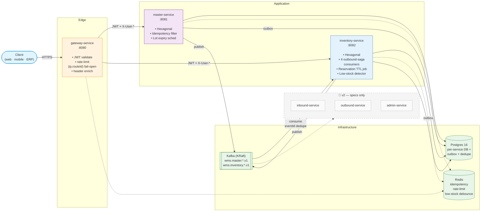
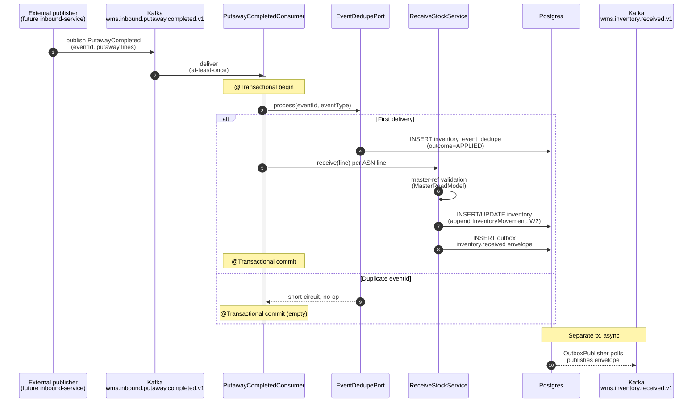
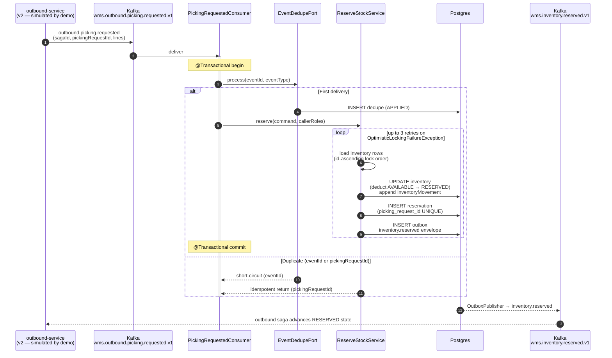
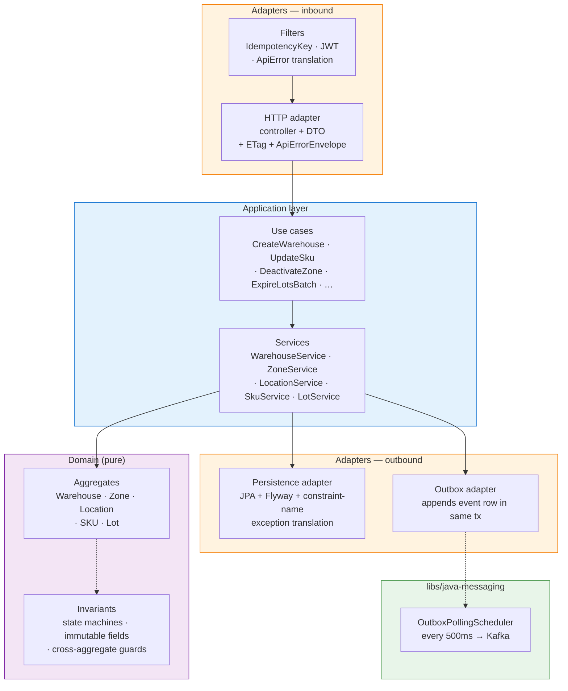
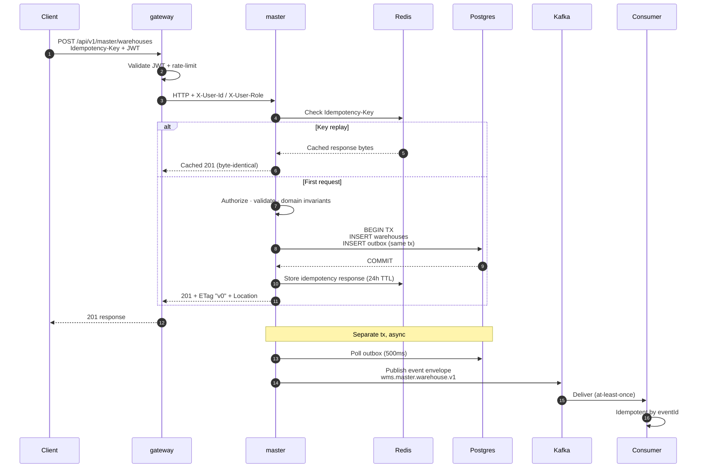

# wms-platform

[](https://github.com/kanggle/wms-platform/actions/workflows/ci.yml?query=branch%3Amain)

> **창고 관리 시스템 백엔드** — 프로덕션 기준으로 설계한 포트폴리오 프로젝트

Spring Boot 3 마이크로서비스: 마스터 데이터 관리, 재고 변이 처리, 엣지 게이트웨이로 구성된 창고 운영의 핵심 시스템입니다. 헥사고날 아키텍처, 트랜잭셔널 아웃박스, 2단계 예약(재고 선점), 멱등성 키, JWT + 요청 제한, 컨트랙트 하네스, 실 컨테이너 E2E 테스트까지 프로덕션 수준의 구현을 목표로 했습니다.

> **v2로 미룬 범위** — `inbound`, `outbound`, `admin` 서비스는 스펙(`specs/services/<name>/`)만 완성된 상태입니다. 넓이보다 깊이를 택한 의도적인 선택입니다 — [Scope-honest v1](#-scope-honest-v1) 참고.

---

## 📍 현황 — v1: master + inventory + gateway

### master-service

| Aggregate | 구현 | 테스트 (unit/slice/H2/Testcontainers) | 이벤트 | 컨트랙트 하네스 |
|---|---|---|---|---|
| **Warehouse** | ✅ | ✅ | ✅ | ✅ |
| **Zone** | ✅ | ✅ | ✅ | ✅ |
| **Location** | ✅ | ✅ | ✅ | ✅ |
| **SKU** | ✅ | ✅ | ✅ | ✅ |
| **Lot** | ✅ | ✅ | ✅ | ✅ |
| Partner | 유예 (Lot의 `supplierPartnerId`는 소프트 검증) | — | — | — |

### inventory-service

| Aggregate / 기능 | 구현 | 테스트 | 이벤트 |
|---|---|---|---|
| `Inventory` + `InventoryMovement` (W2 append-only 원장) | ✅ | ✅ | `inventory.received` |
| `Reservation` — W4/W5 2단계, 상태 머신 `RESERVED → CONFIRMED / RELEASED` | ✅ | ✅ | `inventory.reserved` · `.released` · `.confirmed` |
| `StockAdjustment` — REGULAR · MARK_DAMAGED · WRITE_OFF_DAMAGED | ✅ | ✅ | `inventory.adjusted` |
| `StockTransfer` — W1 원자적 이전, id 오름차순 잠금 순서 | ✅ | ✅ | `inventory.transferred` |
| `LowStockDetection` — 임계값 + Redis SETNX 1h 디바운스, fail-open | ✅ | ✅ | `inventory.low-stock-detected` |
| 아웃바운드 사가 컨슈머 (PickingRequested · PickingCancelled · ShippingConfirmed · PutawayCompleted) | ✅ | ✅ | (인바운드; 동일 TX 내 eventId 중복 제거) |

### gateway-service

JWT 검증 · Redis 요청 제한 (`{ip, routeId}` 복합 키, fail-open 데코레이터) · 헤더 보강 (`X-User-Id`, `X-User-Role`) · master-service와 실 컨테이너 E2E 테스트 5시나리오.

---

## 플랫폼 기반

- **헥사고날 아키텍처 (gateway 제외)** — 도메인이 Spring/JPA에 의존하지 않음. Gateway는 Layered (도메인 없음).
- **트랜잭셔널 아웃박스** — 모든 상태 변경은 같은 DB 트랜잭션 안에서 아웃박스 행을 기록; `OutboxPublisher`(`@Scheduled`, 지수 백오프 + 지터)가 Kafka로 전달. `pending`/`lag.seconds`/`failure.count` 메트릭 제공.
- **모든 컨슈머에 eventId 중복 제거** — `inventory_event_dedupe(event_id, outcome)` 행을 `Propagation.MANDATORY`로 도메인 효과와 같은 TX에 기록. Aggregate 상태 단락(short-circuit)을 내부 가드로 계층화.
- **Idempotency-Key 필터** — Redis 기반 (24h TTL); 재전송 요청 시 바이트 동일 응답 반환. 키 규약은 `idempotency.md` 준수.
- **낙관적 잠금 재시도 + id 오름차순 잠금 순서** — `ReserveStockService`는 `OptimisticLockingFailureException` 발생 시 100–300ms 지터로 최대 3회 재시도; 다중 행 잠금은 id 오름차순으로 획득.
- **애플리케이션 계층에서 인가 처리** — 서비스는 커맨드 레코드(`Set<String> callerRoles`)로 호출자 역할을 수신; 컨트롤러가 `Authentication.getAuthorities()`에서 채워줌. 서비스 내부에서 `SecurityContextHolder` 직접 참조 없음.
- **스케줄러** — Lot 만료 (일별 cron, master) · `ReservationExpiryJob` (`@Scheduled` 행 단위 TX 경계, inventory).
- **테스트** — `@WebMvcTest` 슬라이스 · H2 빠른 테스트 · Testcontainers (Postgres / Kafka / Redis) · JSON Schema 컨트랙트 하네스 · gateway↔master 실 컨테이너 E2E 5시나리오 · inventory-service 유닛 테스트 122개.

---

## 🏛️ 아키텍처

### 시스템 전체 뷰 (v1)



### Putaway → `inventory.received` (서비스 간 이벤트 흐름)



### Picking 사가 참여 — `outbound.picking.requested` → 예약 → `inventory.reserved`



### Master-service 내부 — Hexagonal



### 변경 요청 흐름 (POST / PATCH / deactivate)



---

### 서비스 목록

| 서비스 | 서비스 타입 | 책임 | v1 상태 |
|---|---|---|---|
| `gateway-service` | `rest-api` | 외부 라우팅, JWT 검증, 요청 제한, 헤더 보강 | ✅ 구현 완료 |
| `master-service` | `rest-api` | 마스터 데이터: 창고, 구역, 위치, SKU, Lot | ✅ 구현 완료 |
| `inventory-service` | `rest-api` + `event-consumer` | 위치 기반 재고; W4/W5 예약; 조정·이전·부족 알림; 아웃바운드 사가 참여 | ✅ 구현 완료 |
| `inbound-service` | `rest-api` | ASN 관리, 검수, 적치 | 📐 스펙만 — v2 |
| `outbound-service` | `rest-api` + `event-consumer` (사가 오케스트레이터) | 출고 주문, 피킹, 포장, 배송; 아웃바운드 사가 | 📐 스펙만 — v2 |
| `admin-service` | `rest-api` + `event-consumer` (CQRS 읽기 모델) | 대시보드, KPI, 사용자/권한 관리 | 📐 스펙만 — v2 |

각 서비스의 내부 아키텍처는 `specs/services/<service>/architecture.md`에 선언되어 있습니다. 쓰기 집약적 서비스(master / inventory / inbound / outbound)는 **헥사고날(Ports & Adapters)**을 적용합니다. Gateway와 admin은 Layered입니다(admin은 읽기 전용 / CQRS 형태로 문서화된 `## Overrides` 적용).

### 바운디드 컨텍스트 (`rules/domains/wms.md` 기준)

- **마스터 데이터** — warehouse, zone, location, SKU, partner, lot (v1 구현; partner 유예)
- **인바운드** — ASN, 검수, 적치
- **재고** — 위치 기반 재고, 이전, 조정
- **아웃바운드** — 주문, 피킹, 포장, 배송
- **Admin / 운영** — 대시보드, KPI, 사용자 관리

### 적용 Trait

- **`transactional`** — 변경 경로에 `Idempotency-Key`, 상태 머신, 낙관적 잠금, 트랜잭셔널 아웃박스 적용
- **`integration-heavy`** — ERP / TMS / 스캐너 연동을 전용 포트, 서킷 브레이커, 벌크헤드 패턴으로 대비

[`rules/traits/transactional.md`](rules/traits/transactional.md) · [`rules/traits/integration-heavy.md`](rules/traits/integration-heavy.md) 참고.

---

## 🛠️ 기술 스택

- **언어**: Java 21
- **프레임워크**: Spring Boot 3.4
- **빌드**: Gradle 8.14 (멀티 모듈)
- **영속성**: PostgreSQL 16 + Flyway (서비스별 독립 DB; 공유 DB 없음)
- **메시징**: Apache Kafka (KRaft 모드, 트랜잭셔널 아웃박스)
- **캐시**: Redis (멱등성 키 저장, 요청 제한 카운터)
- **관측성**: Micrometer + Actuator (Prometheus 연동 가능)
- **테스트**: JUnit 5 · AssertJ · Testcontainers · JSON Schema (networknt) · Nimbus JOSE JWT (JWKS 모의) · MockWebServer
- **로컬 개발**: Docker Compose

---

## 🚀 시작하기

### 사전 요구사항

- Java 21 (Temurin 권장)
- Docker (Testcontainers 및 로컬 스택용)

### 로컬 스택 실행

```bash
cp .env.example .env    # 값 입력
docker-compose up -d    # Postgres, Kafka, Redis
```

### 서비스 실행

```bash
# 기본 포트: gateway :8080, master :8081, inventory :8082
./gradlew :apps:gateway-service:bootRun
./gradlew :apps:master-service:bootRun
./gradlew :apps:inventory-service:bootRun
```

> **크로스 프로젝트 포트 네임스페이스** — 서비스는 `${PORT_PREFIX:-2}XXXX` 패턴 사용; `2`는 WMS 접두사로, 다른 포트폴리오 프로젝트(예: ecommerce = `1`)와 동시에 실행 가능. 로컬에서 여러 플랫폼을 함께 띄울 때 환경 변수로 재정의하세요.

### 테스트 실행

```bash
./gradlew :apps:master-service:check       # unit + slice + H2 + Testcontainers
./gradlew :apps:inventory-service:check    # unit + slice + Testcontainers (Postgres/Kafka/Redis)
./gradlew :apps:gateway-service:check
./gradlew check                             # 전체
```

**Windows에서 Testcontainers 실행**: WSL2(Ubuntu + Docker Desktop WSL 통합)에서 테스트를 실행하세요. Windows 네이티브 환경에서는 `@Testcontainers(disabledWithoutDocker = true)`로 Testcontainers 테스트가 자동으로 건너뜁니다.

---

## 🎯 데모 — curl로 실행하는 황금 경로 E2E

마스터 데이터 설정부터 **putaway-completed → inventory.received** 컨슈머 경로(미래의 inbound-service 퍼블리셔 시뮬레이션), **W4/W5 예약 라이프사이클**을 전부 실행합니다. `docker compose up -d` 이후 실행하세요.

```bash
# 스택 + 서비스 실행
docker compose up -d                          # postgres, kafka, redis
./gradlew :apps:gateway-service:bootRun &     # :20080
./gradlew :apps:master-service:bootRun &      # :20081
./gradlew :apps:inventory-service:bootRun &   # :20082

# JWT 취득 (IdP 설정 또는 infra/seed-token.txt 사용)
TOKEN=$(cat infra/seed-token.txt)
H_AUTH="-H Authorization: Bearer $TOKEN"
H_IDEM(){ echo "-H Idempotency-Key: $(uuidgen)"; }
H_JSON="-H Content-Type: application/json"

# 1) 창고 생성 → POST /api/v1/master/warehouses
WH=$(curl -s $H_AUTH $H_JSON $(H_IDEM) -X POST http://localhost:20080/api/v1/master/warehouses \
  -d '{"code":"WH-001","name":"Seoul DC","status":"ACTIVE"}' | jq -r .id)

# 2) 구역, 위치, SKU 생성 (동일 패턴; specs/contracts/http/master-service-api.md 참고)
# ... (생략)

# 3) wms.inbound.putaway.completed.v1 이벤트 발행 (inbound-service 시뮬레이션)
docker exec wms-kafka kafka-console-producer \
  --bootstrap-server localhost:9092 \
  --topic wms.inbound.putaway.completed.v1 < demo/putaway-completed.json
# inventory-service의 PutawayCompletedConsumer가 수신 → ReceiveStockUseCase 호출
# → Inventory + InventoryMovement(W2 원장) 기록 → 아웃박스 통해 inventory.received 발행

# 4) 재고 조회 → GET /api/v1/inventory
curl -s $H_AUTH "http://localhost:20080/api/v1/inventory?warehouseId=$WH" | jq

# 5) 재고 예약 → POST /api/v1/reservations (W4: AVAILABLE → RESERVED)
RESV=$(curl -s $H_AUTH $H_JSON $(H_IDEM) -X POST http://localhost:20080/api/v1/reservations \
  -d "$(cat demo/reserve-request.json)" | jq -r .id)

# 6) 출고 확정 (W5: RESERVED 소비, AVAILABLE 유지)
curl -s $H_AUTH $H_JSON $(H_IDEM) -X POST \
  "http://localhost:20080/api/v1/reservations/$RESV/confirm" \
  -d "$(cat demo/confirm-request.json)"

# 7) Kafka에 이벤트 4건 확인
docker exec wms-kafka kafka-console-consumer \
  --bootstrap-server localhost:9092 \
  --topic wms.inventory.received.v1,wms.inventory.reserved.v1,wms.inventory.confirmed.v1 \
  --from-beginning --max-messages 3
```

> 데모 페이로드 템플릿은 `demo/` 디렉터리에 있습니다 (putaway / reserve / confirm 샘플 JSON). 이 스크립트의 흐름은 `PutawayCompletedConsumerIntegrationTest`와 `PickingFlowIntegrationTest`가 Testcontainers로 검증하는 것과 동일합니다.

---

## 📁 디렉터리 구조

```
wms-platform/
├── PROJECT.md              ← domain=wms, traits=[transactional, integration-heavy]
├── README.md               ← 이 파일
├── CLAUDE.md               ← 규칙 기반 개발 지침 (AI 에이전트 운영 규칙)
├── TEMPLATE.md             ← 프레임워크 추출 가이드 (프로젝트 간 재사용)
├── build.gradle            ← 루트 Gradle 설정 (플러그인 + 서브프로젝트)
├── settings.gradle         ← 모듈 구성
├── docker-compose.yml      ← 로컬 스택
├── .github/workflows/      ← GitHub Actions (check + boot-jar 아티팩트 + e2e 잡)
│
├── libs/                   ← 공유 라이브러리 (프로젝트 무관)
│   ├── java-common/        ← 기반 타입, 예외
│   ├── java-messaging/     ← 아웃박스 퍼블리셔, 이벤트 봉투, Kafka 추상화
│   ├── java-observability/ ← Micrometer 설정, 로깅
│   ├── java-security/      ← JWT 검증, OAuth2 설정
│   ├── java-test-support/
│   └── java-web/
├── platform/               ← 플랫폼 정책 (에러 처리, 테스트 전략, 서비스 타입)
├── rules/                  ← 규칙 분류 체계 (common + domains/wms + traits)
├── .claude/                ← AI 에이전트 설정: skills/, agents/, commands/, config/
│
├── apps/                   ← 서비스 모듈
│   ├── gateway-service/    ← v1 ✅
│   ├── master-service/     ← v1 ✅
│   ├── inventory-service/  ← v1 ✅
│   ├── inbound-service/    ← v2 (스펙만)
│   ├── outbound-service/   ← v2 (스펙만)
│   └── admin-service/      ← v2 (스펙만)
│
├── specs/
│   ├── contracts/
│   │   ├── http/{master,inventory}-service-api.md
│   │   └── events/{master,inventory}-events.md
│   ├── services/
│   │   ├── master-service/    ← architecture, domain-model, idempotency
│   │   ├── inventory-service/ ← architecture, domain-model, idempotency, sagas, state-machines
│   │   ├── inbound-service/   ← architecture, domain-model (v2 — 코드 선행 스펙)
│   │   ├── outbound-service/  ← architecture, domain-model (v2)
│   │   └── admin-service/     ← architecture, domain-model (v2)
│   ├── features/
│   └── use-cases/
├── tasks/
│   ├── INDEX.md            ← 태스크 라이프사이클 규칙
│   ├── templates/          ← 태스크 템플릿 (공유)
│   └── done/               ← v1 개발에서 완료된 태스크 32개
├── knowledge/
│   └── adr/                ← 아키텍처 결정 기록
├── docs/                   ← 운영 문서 + 공유 가이드
├── infra/                  ← Prometheus, Grafana, Loki 설정
└── docker/                 ← Docker 빌드 컨텍스트 (DB 초기화 등)
```

---

## 📐 핵심 설계 결정

### v1 엔티티 범위 (마스터 데이터)

5개 Aggregate 구현: **Warehouse · Zone · Location · SKU · Lot**. Partner 유예 (Lot의 `supplierPartnerId`는 v1에서 소프트 검증). 공통 필드: `id`, `*_code`, `name`, `status`, `version`, 타임스탬프, 행위자 ID. 소프트 비활성화만 지원 (v1에서 하드 삭제 없음). 상세: [specs/services/master-service/domain-model.md](specs/services/master-service/domain-model.md).

### 크로스 Aggregate 불변 조건 (핵심 설계)

Lot 생성 시 부모 SKU의 `trackingType == LOT` AND `status == ACTIVE` 조건을 모두 검증합니다. 반대로, 활성 Lot이 존재하는 SKU의 비활성화는 차단됩니다(`REFERENCE_INTEGRITY_VIOLATION` 409). Zone 비활성화는 활성 Location이 있으면 차단, Warehouse 비활성화는 활성 Zone이 있으면 차단. 각 가드는 `hasActive*For(...)` 포트 메서드로 구현 — 실제 JPA `existsBy*AndStatus` 쿼리이며 스텁이 아닙니다.

### 쓰기 집약적 서비스에 헥사고날 아키텍처 적용

Master는 헥사고날로 도메인 로직을 인프라와 분리합니다. Gateway는 Layered (풍부한 도메인 없음). 선택 이유: ERP, TMS, 스캐너 등 다양한 외부 통합의 다양성이 Ports & Adapters 은유와 자연스럽게 맞기 때문입니다. 상세: [specs/services/master-service/architecture.md](specs/services/master-service/architecture.md).

### 이벤트 발행을 위한 트랜잭셔널 아웃박스

모든 상태 변경은 같은 DB 트랜잭션에서 아웃박스 행을 기록하고, 별도 퍼블리셔(`libs/java-messaging`의 `OutboxPollingScheduler`)가 Kafka로 전달합니다. 커밋된 변경당 정확히 한 번 발행을 보장합니다. 최소 한 번 전달이므로 컨슈머는 `eventId`로 멱등성을 유지해야 합니다.

### `timestamp`를 포함한 에러 봉투

모든 에러 응답은 `platform/error-handling.md`에 따라 `{code, message, timestamp}` (ISO 8601 UTC)를 포함합니다. `STATE_TRANSITION_INVALID` → 422, `REFERENCE_INTEGRITY_VIOLATION` → 409, `IMMUTABLE_FIELD` 시도 → 422, 버전 충돌 → 409. `HttpContractTest` / `EventContractTest`에서 JSON Schema로 검증합니다.

### 모든 변경 엔드포인트에 Idempotency-Key 적용

클라이언트 제공 UUID + 메서드 + 경로 스코프. Redis 기반 저장, 24h TTL. Redis 장애 시 fail-closed (503). 상세: [specs/services/master-service/idempotency.md](specs/services/master-service/idempotency.md).

### Gateway 요청 제한 — 복합 키 + Fail-Open

키는 `{clientIp}:{routeId}` (IP 단독이 아님 — 미래의 `/inventory/**` 라우트가 master 버킷을 공유하지 않도록). `FailOpenRateLimiter` 데코레이터가 `RedisRateLimiter`를 감쌉니다: Redis 불가 → 요청 통과 + WARN 로그 (`platform/api-gateway-policy.md` 기준).

### v1 로컬 참조 무결성

Master-service는 비활성화 시 자신의 하위 레코드만 확인합니다. 서비스 간 재고·주문 참조는 v1 범위 밖입니다 (처리하려면 `deactivation.requested` 사가가 필요). 알려진 제한 사항으로 컨트랙트에 문서화되어 있습니다.

### W4 / W5 2단계 예약 (inventory-service)

Reserve는 `AVAILABLE`을 직접 감소시키지 않고 `AVAILABLE → RESERVED`로 이동시킵니다. Confirm은 `RESERVED`를 소비하며 `AVAILABLE`은 그대로 유지합니다. 상태 머신: `RESERVED → CONFIRMED / RELEASED`. 효과:

- **Reserve는 재시도에 멱등** — 재전송 후에도 사후 조건(`예약이 RESERVED 상태`)은 동일.
- **Confirm은 브로큰 파이프에 면역** — 예약 버킷이 출고 확인 도착 전까지 약속을 유지.
- 같은 구조로 취소 / TTL 해제 처리 시 `AVAILABLE`을 한 번만 건드림.

코드: `Inventory.reserve / release / confirm`, `ReserveStockService`, `ConfirmReservationService`. 도메인 규칙 W4/W5는 [`rules/domains/wms.md`](rules/domains/wms.md).

### 낙관적 잠금 재시도 + id 오름차순 잠금 순서

`ReserveStockService`는 `OptimisticLockingFailureException` 발생 시 100–300ms 지터로 최대 3회 재시도합니다. 다중 행 업데이트는 `compareTo`로 id 오름차순으로 잠금을 획득해, 겹치는 행을 가진 두 예약이 동시 실행되어도 애플리케이션 수준 교착 상태가 발생하지 않습니다. Postgres 수준 교착 상태는 재시도로 처리하며, 이 순서 전략은 회피하기 쉬운 애플리케이션 수준 케이스를 제거합니다.

Trait T5 (낙관적 잠금 우선; 비관적 잠금 금지). [`ReserveStockService`](apps/inventory-service/src/main/java/com/wms/inventory/application/service/ReserveStockService.java).

### W1 원자적 이전 (id 오름차순 잠금 순서)

`TransferStockService`는 하나의 TX에서 출발·도착 재고 행을 업데이트하며, id 오름차순으로 잠금을 획득해 상호 교착 상태를 방지합니다. 도착지는 없으면 생성하는 upsert (`wasCreated` 플래그가 `inventory.transferred` 이벤트 페이로드에 전파). 창고 간 이전은 `MasterReadModelPort` 조회로 거부됩니다.

### 부족 재고 알림 디바운싱 (fail-open)

`LowStockDetectionService`는 `AVAILABLE` 감소마다 임계값을 평가합니다. 임계값 초과 시 `inventoryId` 키, 1h TTL의 Redis `SETNX`로 디바운싱합니다. **Fail-open**: SETNX 중 Redis 오류 발생 시 알림은 그대로 발송됩니다 — 디바운스는 성능 힌트이지 안전 속성이 아닙니다. `inventory.low-stock-detected` 이벤트는 다른 도메인 이벤트와 동일한 아웃박스 경로를 사용합니다.

### 모든 컨슈머에 eventId 중복 제거 (T8)

모든 Kafka 컨슈머(`PutawayCompletedConsumer`, `PickingRequestedConsumer`, `PickingCancelledConsumer`, `ShippingConfirmedConsumer`, 마스터 스냅샷 트리오 포함)는 `Propagation.MANDATORY`를 선언한 `EventDedupePersistenceAdapter`를 통해 도메인 효과와 같은 TX에서 `inventory_event_dedupe(event_id, outcome)` 행을 기록합니다. Aggregate 상태 단락(예: 종료 상태 예약 no-op)을 내부 가드로 계층화합니다.

이 분리 — eventId 외부 가드, 비즈니스 상태 내부 가드 — 는 두 가지 서로 다른 경쟁 상태를 처리합니다: Kafka 재전달 (외부)과 크로스 컨슈머 뮤테이션 (내부, 예: 메시지와 핸들러 사이에 도착하는 수동 REST 취소).

### 애플리케이션 계층에서 인가 처리

재고 변이 서비스는 커맨드 레코드(`AdjustStockCommand`의 `Set<String> callerRoles`)로 호출자 역할을 수신합니다. 컨트롤러가 `Authentication.getAuthorities()`에서 채워주고, 서비스가 정책을 결정하여 `AccessDeniedException`을 던집니다(`GlobalExceptionHandler`가 403으로 매핑).

컨트롤러는 더 이상 JWT 클레임을 직접 파싱하지 않습니다. 이유: 서비스가 프레임워크에 독립적으로 유지되고, 인가 결정이 비즈니스 불변 조건이 있는 곳에 위치합니다. `architecture.md` §Security 기준.

---

## 🎯 Scope-honest v1

| 서비스 | architecture.md | domain-model.md | 컨트랙트 | 구현 | 테스트 |
|---|:---:|:---:|:---:|:---:|:---:|
| `gateway-service` | ✅ | (해당 없음) | (gateway-routes 스펙) | ✅ | ✅ |
| `master-service` | ✅ | ✅ | ✅ | ✅ | ✅ |
| `inventory-service` | ✅ | ✅ | ✅ | ✅ | ✅ |
| `inbound-service` | ✅ | ✅ | ❌ | ❌ | ❌ |
| `outbound-service` | ✅ | ✅ | ❌ | ❌ | ❌ |
| `admin-service` | ✅ | ✅ | ❌ | ❌ | ❌ |

`inbound`, `outbound`, `admin` 서비스는 `specs/services/<name>/`에 아키텍처와 도메인 모델 스펙이 완전히 작성되어 있지만, 컨트랙트 / 구현 / 테스트는 의도적으로 **v2 범위**입니다. 각 `architecture.md`는 첫 번째 구현 태스크가 `tasks/ready/`로 이동하기 전에 완성해야 할 항목을 "Open Items" 섹션으로 나열합니다.

**범위를 의도적으로 좁힌 이유**: 넓이보다 깊이. master + inventory만으로 규칙 세트에 선언된 모든 아키텍처 패턴을 실행합니다 — 헥사고날 레이아웃, 트랜잭셔널 아웃박스, eventId 중복 제거, 2단계 사가 참여, 낙관적 잠금 재시도, 멱등성, JWT + 역할 기반 인가, 관측성 메트릭, 컨트랙트 하네스. 반쯤 구현된 서비스 3개를 추가하면 새로운 패턴 없이 리뷰 가치만 희석됩니다.

`inventory-service.PutawayCompletedConsumer`는 실제 Kafka 토픽에서 `wms.inbound.putaway.completed.v1`을 소비합니다; E2E 데모에서는 이벤트를 데모 스크립트가 직접 발행합니다([데모](#-데모--curl로-실행하는-황금-경로-e2e) 참고). v2에서 inbound-service가 구현되면 inventory-service 변경 없이 그 이벤트의 퍼블리셔로 연결됩니다.

---

## 🧭 개발 방식

> **전체 과정** (규칙 레이어 · `/process-tasks` 파이프라인 · 리뷰 규율 · 구체적 아티팩트): [docs/guides/development-process.md](docs/guides/development-process.md)

이 프로젝트는 **[Claude Code](https://claude.com/claude-code)** 기반의 규칙 주도, 태스크 중심 워크플로우를 따릅니다:

- **스펙 선행**: 컨트랙트, 아키텍처, 도메인 모델을 구현 전에 먼저 작성.
- **분류 체계 기반 규칙 활성화**: `PROJECT.md`가 `domain=wms, traits=[transactional, integration-heavy]`를 선언. AI는 각 선언된 trait에 맞는 `rules/common.md` + `rules/domains/wms.md` + `rules/traits/*`를 로드 — 다른 규칙은 참조하지 않음.
- **Skills + Agents**: `.claude/skills/`에 80개 이상의 재사용 가능한 스킬 (헥사고날 구조, 아웃박스 패턴, 멱등 컨슈머, 테스트 전략 등)과 `.claude/agents/`에 전문 서브에이전트(`architect`, `backend-engineer`, `code-reviewer`, `qa-engineer`, `api-designer`).
- **태스크 라이프사이클**: `ready → in-progress → review → done`. `tasks/ready/` 항목만 구현. 모든 태스크는 Plan → Implement → Test → Review를 거침.
- **/process-tasks**: 최상위 파이프라인 커맨드 — `ready/`의 모든 항목을 워크트리 격리 서브에이전트로 일괄 구현, 이후 `review/`의 모든 항목을 병렬 리뷰.
- **리뷰 규율**: 모든 구현은 독립적인 리뷰 패스를 거침. 결과는 `APPROVE` 또는 `FIX NEEDED` → 새 수정 티켓. 전부 `tasks/INDEX.md`에 판정 + 후속 조치와 함께 기록.

전체 개발 이력 (19개 완료 태스크, 60개 이상의 커밋)은 **[kanggle/monorepo-lab](https://github.com/kanggle/monorepo-lab)** 에 있습니다 — 이 레포는 `scripts/sync-portfolio.sh`를 통해 추출한 스냅샷입니다.

---

## 🔗 관련 링크

- **개발 워크스페이스**: [kanggle/monorepo-lab](https://github.com/kanggle/monorepo-lab) — 태스크 작성, 리뷰, 머지가 이루어지는 원본 레포
- **포트폴리오 허브**: [github.com/kanggle](https://github.com/kanggle) — 다른 프로젝트

### 스펙 (이 레포 안에 있음)

- [PROJECT.md](PROJECT.md) — domain/traits 선언, 서비스 맵, 범위 외 목록

**v1 — 구현 완료:**
- [specs/services/master-service/architecture.md](specs/services/master-service/architecture.md) · [domain-model.md](specs/services/master-service/domain-model.md) · [idempotency.md](specs/services/master-service/idempotency.md)
- [specs/services/inventory-service/architecture.md](specs/services/inventory-service/architecture.md) · [domain-model.md](specs/services/inventory-service/domain-model.md) · [idempotency.md](specs/services/inventory-service/idempotency.md)
- [specs/services/gateway-service/architecture.md](specs/services/gateway-service/architecture.md) · [public-routes.md](specs/services/gateway-service/public-routes.md)
- [specs/contracts/http/master-service-api.md](specs/contracts/http/master-service-api.md) · [inventory-service-api.md](specs/contracts/http/inventory-service-api.md)
- [specs/contracts/events/master-events.md](specs/contracts/events/master-events.md) · [inventory-events.md](specs/contracts/events/inventory-events.md)

**v2 — 스펙만:**
- [specs/services/inbound-service/architecture.md](specs/services/inbound-service/architecture.md) · [domain-model.md](specs/services/inbound-service/domain-model.md)
- [specs/services/outbound-service/architecture.md](specs/services/outbound-service/architecture.md) · [domain-model.md](specs/services/outbound-service/domain-model.md)
- [specs/services/admin-service/architecture.md](specs/services/admin-service/architecture.md) · [domain-model.md](specs/services/admin-service/domain-model.md)

### 규칙

- [rules/common.md](rules/common.md) — 항상 로드되는 규칙 인덱스
- [rules/domains/wms.md](rules/domains/wms.md) — WMS 도메인 규칙 (W1–W6)
- [rules/traits/transactional.md](rules/traits/transactional.md) — T1–T8
- [rules/traits/integration-heavy.md](rules/traits/integration-heavy.md) — I1–I10

---

## 📄 라이선스

라이선스 미정. 현재 오픈 소스 아님.
