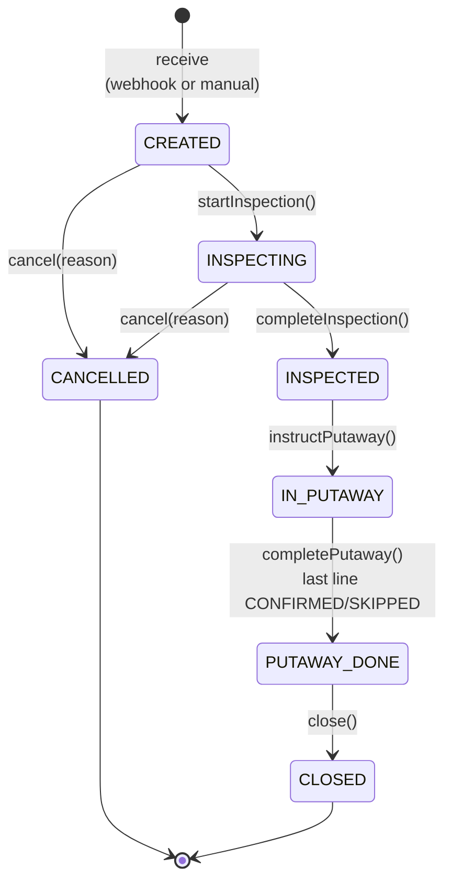

# inbound-service — ASN State Machine

Authoritative state machine for the **Asn** aggregate root. Implementation must
match this diagram exactly. State transitions are domain methods (T4 — direct
status `UPDATE` is forbidden).

Consumers: `RecordInspectionUseCase`, `InstructPutawayUseCase`,
`ConfirmPutawayUseCase`, `CloseAsnUseCase`, `CancelAsnUseCase`. The webhook
ingest path and manual REST creation both terminate in `ReceiveAsnUseCase`,
which produces an ASN already in `CREATED`.

This document is referenced from `architecture.md` § Concurrency Control and
`domain-model.md` §1 Asn.

---

## States

| State | Terminal | Description |
|---|---|---|
| `CREATED` | no | ASN received; goods not yet at dock. Lines may be reviewed but not modified. |
| `INSPECTING` | no | Inspection has started. AsnLines become immutable. |
| `INSPECTED` | no | Inspection finalised; quantities reconciled. May still hold unacknowledged discrepancies — those block forward transition (`INSPECTION_INCOMPLETE`). |
| `IN_PUTAWAY` | no | Putaway instruction issued; operators are placing goods at destinations. |
| `PUTAWAY_DONE` | no | All `PutawayLine`s reached `CONFIRMED` or `SKIPPED`. Awaiting close. |
| `CLOSED` | **yes** | ASN finalised; no further mutation. |
| `CANCELLED` | **yes** | ASN cancelled before any putaway happened. |

---

## Transitions

```
                ┌────────────────────────────┐
                │        [receive]           │
                │   (webhook or manual)      │
                └────────────┬───────────────┘
                             ▼
                        ┌─────────┐
              ┌────────▶│ CREATED │────────┐
              │         └────┬────┘        │
              │              │ start       │
              │ cancel       │ Inspection  │
              ▼              ▼             │
        ┌───────────┐   ┌────────────┐    │
        │ CANCELLED │◀──│ INSPECTING │    │
        │ (terminal)│   └─────┬──────┘    │
        └───────────┘         │ complete  │
              ▲               │ Inspection│
              │ cancel        ▼            │
              │         ┌────────────┐    │
              └─────────│ INSPECTED  │    │
                        └─────┬──────┘    │
                              │ instruct  │
                              │ Putaway   │
                              ▼            │
                        ┌────────────┐    │
                        │ IN_PUTAWAY │    │
                        └─────┬──────┘    │
                              │ complete  │
                              │ Putaway   │
                              │ (last     │
                              │  line)    │
                              ▼            │
                        ┌────────────┐    │
                        │PUTAWAY_DONE│    │
                        └─────┬──────┘    │
                              │ close     │
                              ▼            │
                        ┌────────────┐    │
                        │   CLOSED   │    │
                        │ (terminal) │    │
                        └────────────┘    │
                                          │
       (any non-listed transition) ───────┘
            → STATE_TRANSITION_INVALID (422)
```

**Mermaid:**



---

## Transition Rules

| From | To | Method | Trigger | Side-effects |
|---|---|---|---|---|
| (none) | `CREATED` | `Asn.receive(...)` factory | Webhook ingest or `POST /asns` | Outbox: `inbound.asn.received` |
| `CREATED` | `INSPECTING` | `Asn.startInspection(actorId)` | `POST /asns/{id}/inspection:start` | None (ledger-only domain event; no outbox in v1) |
| `INSPECTING` | `INSPECTED` | `Asn.completeInspection(actorId)` | `RecordInspectionUseCase` finalises Inspection | Outbox: `inbound.inspection.completed` |
| `INSPECTED` | `IN_PUTAWAY` | `Asn.instructPutaway(plannerId)` | `InstructPutawayUseCase` creates `PutawayInstruction` | Outbox: `inbound.putaway.instructed` |
| `IN_PUTAWAY` | `PUTAWAY_DONE` | `Asn.completePutaway()` | Final `ConfirmPutawayUseCase` call (last `PutawayLine` confirmed/skipped) | Outbox: `inbound.putaway.completed` (cross-service contract) |
| `PUTAWAY_DONE` | `CLOSED` | `Asn.close(actorId)` | `POST /asns/{id}:close` | Outbox: `inbound.asn.closed` |
| `CREATED` / `INSPECTING` | `CANCELLED` | `Asn.cancel(reason, actorId)` | `POST /asns/{id}:cancel` | Outbox: `inbound.asn.cancelled` |

Any other invocation throws `StateTransitionInvalidException` → HTTP 422
`STATE_TRANSITION_INVALID`.

---

## Guard Conditions

These pre-conditions are checked **inside** the domain method before the state
transition. Failing a guard throws a domain exception, NOT
`STATE_TRANSITION_INVALID`.

| Transition | Guard | Failure code |
|---|---|---|
| `CREATED → INSPECTING` | At least one `AsnLine` exists | `VALIDATION_ERROR` (should never trigger in practice — invariant from creation) |
| `INSPECTING → INSPECTED` | Every `AsnLine` has exactly one `InspectionLine` | `INSPECTION_INCOMPLETE` |
| `INSPECTING → INSPECTED` | All `InspectionDiscrepancy` rows have `acknowledged = true` | `INSPECTION_INCOMPLETE` |
| `INSPECTED → IN_PUTAWAY` | `PutawayInstruction` does not yet exist for this ASN | `STATE_TRANSITION_INVALID` (would create a duplicate plan) |
| `IN_PUTAWAY → PUTAWAY_DONE` | All `PutawayLine`s in the instruction are `CONFIRMED` or `SKIPPED` | called only when this is true; otherwise `Asn` stays in `IN_PUTAWAY` (no error — partial confirm is normal) |
| `PUTAWAY_DONE → CLOSED` | `actorId` has role `INBOUND_WRITE` or `INBOUND_ADMIN` | `FORBIDDEN` (403) — checked at application layer |
| `* → CANCELLED` | `from ∈ {CREATED, INSPECTING}` | `ASN_ALREADY_CLOSED` (422) for any later state — explicitly NOT `STATE_TRANSITION_INVALID` to surface the business reason |

---

## Concurrency

- Optimistic lock: `Asn.version` (T5).
- Two operators racing on the same ASN: the second commit gets `CONFLICT` (409).
  The application MUST NOT auto-retry state transitions — the caller refetches
  the aggregate and re-evaluates whether the action is still valid in the new
  state.
- Putaway confirmations are concurrent-safe per line (each `ConfirmPutawayUseCase`
  invocation locks one `PutawayInstruction` row); the final transition to
  `PUTAWAY_DONE` is a `compareAndSet`-style guard.

---

## Reverse / Compensation Flows (v1: forbidden)

Once `IN_PUTAWAY` is entered:

- ❌ **Cancellation forbidden**: any cancel attempt → `ASN_ALREADY_CLOSED` (422).
- ❌ **Inspection mutation forbidden**: AsnLine quantities are immutable from
  `INSPECTING`; Inspection results are immutable from `IN_PUTAWAY`.
- ❌ **Reverse putaway forbidden**: a confirmed `PutawayLine` cannot be
  un-confirmed in v1. To correct an erroneous receipt, ops creates a manual
  `inventory-service` adjustment after-the-fact.

This intentional asymmetry trades flexibility for ledger integrity. v2 may
introduce a reverse-saga that fires `inventory.received` compensations.

---

## Error-Code Mapping (controller → response)

| Domain exception | HTTP | Code |
|---|---|---|
| `StateTransitionInvalidException` | 422 | `STATE_TRANSITION_INVALID` |
| `AsnAlreadyClosedException` | 422 | `ASN_ALREADY_CLOSED` |
| `InspectionIncompleteException` | 422 | `INSPECTION_INCOMPLETE` |
| `OptimisticLockingFailureException` | 409 | `CONFLICT` |
| `AsnNotFoundException` | 404 | `ASN_NOT_FOUND` |

Full registry: `platform/error-handling.md` § Inbound `[domain: wms]`.

---

## Test Requirements

Per `architecture.md` § Testing Requirements:

- **Unit (Domain)**: every transition listed in the table above + every
  `STATE_TRANSITION_INVALID` case (the cross-product minus the legal arrows).
  Each guard condition must have its own failing test.
- **Application Service**: each use-case verifies that a successful invocation
  writes exactly one outbox row in the same `@Transactional` boundary as the
  status change.
- **Persistence Adapter**: optimistic-lock conflict on `Asn.version`.
- **Failure-mode**: cancel-after-putaway → `ASN_ALREADY_CLOSED`;
  unacknowledged-discrepancy + complete-inspection → `INSPECTION_INCOMPLETE`.

---

## References

- `architecture.md` § Concurrency Control / State Machine
- `domain-model.md` §1 Asn
- `workflows/inbound-flow.md` — narrative walk-through
- `rules/traits/transactional.md` — T4 (no direct status update), T5 (optimistic lock)
- `rules/domains/wms.md` § Standard Error Codes (Inbound)
- `platform/error-handling.md` — registry of error codes
- `specs/contracts/events/inbound-events.md` — outbox events fired per transition
