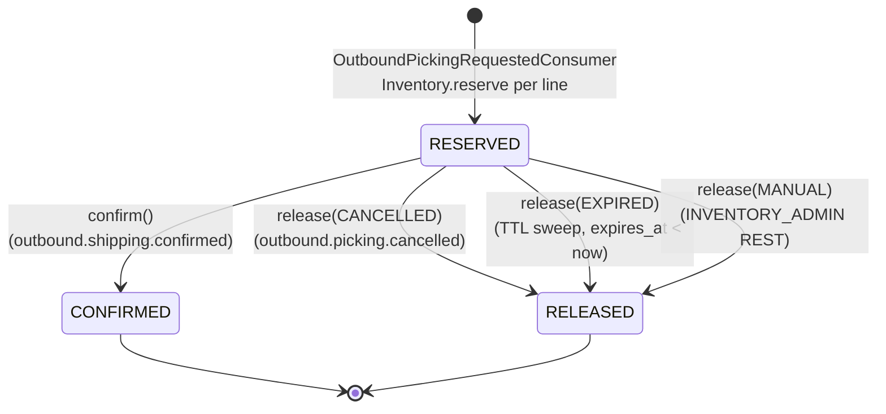

# inventory-service — Reservation State Machine

Authoritative state machine for the **Reservation** aggregate.
Implementation must match this diagram exactly. State transitions are
domain methods on `Reservation` (T4 — direct status `UPDATE` outside the
domain method path is forbidden and enforced at code-review level).

This document is referenced from
[`../architecture.md`](../architecture.md) § State Machines § Reservation
lifecycle (line 529-547),
[`../domain-model.md`](../domain-model.md) § 3 Reservation § State Machine
(line 297-308) and § State Machines (Cross-reference) (line 617-628),
and [`../sagas/reservation-saga.md`](../sagas/reservation-saga.md). For
the orchestrator-side saga machine spanning two services, see the
sibling [`../../outbound-service/state-machines/saga-status.md`](../../outbound-service/state-machines/saga-status.md).

---

## States

| State | Terminal | Triggered by | Description |
|---|---|---|---|
| `RESERVED` | no | `OutboundPickingRequestedConsumer` (Kafka, `outbound.picking.requested`) | Reservation created. Per-line `Inventory.reserve(qty, reservationId)` decremented `available_qty` and incremented `reserved_qty` on every line's row. `expires_at` set to `now + warehouse.reservation_ttl` (default 24h). Awaits `outbound.shipping.confirmed` (→ CONFIRMED), `outbound.picking.cancelled` (→ RELEASED), TTL elapse (→ RELEASED, reason `EXPIRED`), or `INVENTORY_ADMIN` manual release (→ RELEASED, reason `MANUAL`). |
| `CONFIRMED` | **yes** | `OutboundShippingConfirmedConsumer` (Kafka, `outbound.shipping.confirmed`) | Per-line `Inventory.confirm(qty, reservationId)` decremented `reserved_qty` (no paired `available` row — stock consumed, not returned). `confirmed_at` set. Emits `inventory.confirmed`. No further mutation on this row, ever. |
| `RELEASED` | **yes** | `OutboundPickingCancelledConsumer` (Kafka, reason `CANCELLED`) OR TTL sweep (`ReleaseReservationService.releaseExpired`, reason `EXPIRED`) OR `INVENTORY_ADMIN` REST manual release (reason `MANUAL`) | Per-line `Inventory.release(qty, reservationId, reason)` decremented `reserved_qty` and incremented `available_qty`. `released_reason` and `released_at` set. Emits `inventory.released`. No further mutation, ever. |

---

## Transitions

```
                    [OutboundPickingRequestedConsumer
                     creates reservation + per-line
                     Inventory.reserve(qty, reservationId)]
                                  │
                                  ▼
                          ┌──────────────┐
                          │   RESERVED   │
                          └──────┬───────┘
                                 │
            ┌────────────────────┼──────────────────────┐
            │                    │                      │
        confirm()             release()              release()
        (shipping.            (picking.              (TTL sweep OR
         confirmed)            cancelled,             INVENTORY_ADMIN
                               reason=CANCELLED)      manual,
                                                      reason=EXPIRED |
                                                      MANUAL)
            │                    │                      │
            ▼                    ▼                      ▼
    ┌──────────────┐      ┌──────────────┐      ┌──────────────┐
    │  CONFIRMED   │      │   RELEASED   │      │   RELEASED   │
    │  (terminal)  │      │  (terminal)  │      │  (terminal)  │
    └──────────────┘      └──────────────┘      └──────────────┘
```



### Per-transition rules

| From | To | Domain method | Triggering source | Side effects (atomic) | Outbox event |
|---|---|---|---|---|---|
| `RESERVED` | `CONFIRMED` | `Reservation.confirm()` | `outbound.shipping.confirmed` (Kafka) | per-line `Inventory.confirm(qty, reservationId)` → 1 Movement row (`RESERVED delta=-N`, `reason_code=SHIPPING_CONFIRMED`); set `confirmed_at=now`; bump `version` | `inventory.confirmed` |
| `RESERVED` | `RELEASED` (`CANCELLED`) | `Reservation.release(CANCELLED)` | `outbound.picking.cancelled` (Kafka) | per-line `Inventory.release(qty, reservationId, reason)` → 2 Movement rows (`RESERVED -N` + `AVAILABLE +N`, `reason_code=PICKING_CANCELLED`); set `released_reason=CANCELLED`, `released_at=now`; bump `version` | `inventory.released` |
| `RESERVED` | `RELEASED` (`EXPIRED`) | `Reservation.release(EXPIRED)` | TTL sweep job (`@Scheduled`, interval 60s, batch 200) — selects `WHERE status='RESERVED' AND expires_at < NOW()`; each row in its own `@Transactional` | per-line `Inventory.release(qty, reservationId, reason)` → 2 Movement rows (`RESERVED -N` + `AVAILABLE +N`, `reason_code=PICKING_EXPIRED`); set `released_reason=EXPIRED`; bump `version`; emit metric `inventory.reservation.expiry.swept.total += released-count` (ADR-MONO-005 § D5) | `inventory.released` |
| `RESERVED` | `RELEASED` (`MANUAL`) | `Reservation.release(MANUAL)` | `INVENTORY_ADMIN` REST manual release (`POST /api/v1/inventory/reservations/{id}:release`, `Idempotency-Key` required) | per-line `Inventory.release(qty, reservationId, reason)` → 2 Movement rows (`RESERVED -N` + `AVAILABLE +N`, `reason_code=ADJUSTMENT_RECLASSIFY` or `PICKING_CANCELLED` per ops policy); set `released_reason=MANUAL`; bump `version` | `inventory.released` |

### Forbidden transitions

| From | To | Why |
|---|---|---|
| `CONFIRMED` | any | Terminal-once: confirmed stock is consumed (W5). Restoring stock after a confirmed shipment is modelled as **new** `RECEIVE` + outbound cancellation chain, not as state regression on this row |
| `RELEASED` | any | Terminal-once: a cancelled-then-recreated picking request must use a **new** `picking_request_id` upstream (idempotency enforcement, see `domain-model.md § 3 Reservation § Invariants`) |
| `RESERVED` | `RESERVED` | Self-loop forbidden: TTL extension is **not supported in v1** (single-shot allocation lifetime per `domain-model.md § 3` invariant) |

---

## Transition Rules

Each row in the table below corresponds to one domain method call inside one
`@Transactional` boundary. Pre-conditions listed here are **transition-level
preconditions** — structural checks that the domain method performs before
mutating state. Post-conditions are side-effects that commit atomically with
the status change.

| From | To | Domain method | Pre-condition | Post-conditions (atomic) | Outbox event |
|---|---|---|---|---|---|
| (none) | `RESERVED` | `Reservation.reserve(pickingRequestId, warehouseId, lines, ttl)` factory | `available_qty >= qty` for every line (`INSUFFICIENT_STOCK` otherwise); all `sku_id`s / `lot_id`s / `location_id`s ACTIVE per MasterReadModel; at least one line; all lines share same `warehouse_id` | Insert `Reservation` + N `ReservationLine`s; per-line `Inventory.reserve(qty, reservationId)` writes 2 `InventoryMovement` rows (`AVAILABLE delta=-N` + `RESERVED delta=+N`, `reason_code=PICKING`); `expires_at = now + warehouse.reservation_ttl`; bump `Inventory.version` per line | `inventory.reserved` |
| `RESERVED` | `CONFIRMED` | `Reservation.confirm()` | `status == RESERVED`; shipped-qty per line equals reserved-qty per line (W4 / W5 — `RESERVATION_QUANTITY_MISMATCH` otherwise); `RESERVATION_ALREADY_RELEASED` if `status == RELEASED` | Per-line `Inventory.confirm(qty, reservationId)` writes 1 `InventoryMovement` row (`RESERVED delta=-N`, `reason_code=SHIPPING_CONFIRMED`); set `confirmed_at=now`; bump `version` | `inventory.confirmed` |
| `RESERVED` | `RELEASED` (`CANCELLED`) | `Reservation.release(CANCELLED)` | `status == RESERVED` (no-op if already `RELEASED` — idempotent) | Per-line `Inventory.release(qty, reservationId, CANCELLED)` writes 2 `InventoryMovement` rows (`RESERVED delta=-N` + `AVAILABLE delta=+N`, `reason_code=PICKING_CANCELLED`); set `released_reason=CANCELLED`, `released_at=now`; bump `version` | `inventory.released` (reason=`CANCELLED`) |
| `RESERVED` | `RELEASED` (`EXPIRED`) | `Reservation.release(EXPIRED)` | `status == RESERVED` AND `expires_at < NOW()` (selected by sweeper query) | Per-line `Inventory.release(qty, reservationId, EXPIRED)` writes 2 `InventoryMovement` rows (`RESERVED delta=-N` + `AVAILABLE delta=+N`, `reason_code=PICKING_EXPIRED`); set `released_reason=EXPIRED`, `released_at=now`; bump `version`; emit metric `inventory.reservation.expiry.swept.total` | `inventory.released` (reason=`EXPIRED`) |
| `RESERVED` | `RELEASED` (`MANUAL`) | `Reservation.release(MANUAL)` | `status == RESERVED` (no-op if already `RELEASED` — idempotent via `Idempotency-Key`); `actorId` has role `INVENTORY_ADMIN` | Per-line `Inventory.release(qty, reservationId, MANUAL)` writes 2 `InventoryMovement` rows (`RESERVED delta=-N` + `AVAILABLE delta=+N`, `reason_code=ADJUSTMENT_RECLASSIFY`); set `released_reason=MANUAL`, `released_at=now`; bump `version` | `inventory.released` (reason=`MANUAL`) |

Any invocation that does not match a row above throws
`StateTransitionInvalidException` → HTTP 422 `STATE_TRANSITION_INVALID`.

---

## Guard Conditions

These pre-conditions are checked **inside** the domain method before the
state transition. Failing a guard throws a typed domain exception — NOT the
generic `STATE_TRANSITION_INVALID`. Guards are a sub-set of the
Transition Rules pre-conditions; they are listed here separately for
implementation clarity.

| Transition | Guard | Failure code |
|---|---|---|
| `(none) → RESERVED` | `available_qty >= qty` for every `ReservationLine` | `INSUFFICIENT_STOCK` (triggers `inventory.adjusted` outbox, not `inventory.reserved`) |
| `(none) → RESERVED` | All `sku_id`s ACTIVE per MasterReadModel | `SKU_INACTIVE` (same treatment as `INSUFFICIENT_STOCK` — rolled back, emits `inventory.adjusted{reason=SKU_INACTIVE}`) |
| `(none) → RESERVED` | All `lot_id`s non-EXPIRED and ACTIVE per MasterReadModel (LOT-tracked SKUs) | `LOT_INACTIVE` / `LOT_EXPIRED` |
| `(none) → RESERVED` | `location_id` for each line ACTIVE per MasterReadModel | `LOCATION_INACTIVE` |
| `(none) → RESERVED` | At least one `ReservationLine` | `VALIDATION_ERROR` (422) — invariant from upstream picking plan |
| `(none) → RESERVED` | All lines share same `warehouse_id` | `WAREHOUSE_MISMATCH` (422) — cross-warehouse allocation forbidden in v1 |
| `RESERVED → CONFIRMED` | Shipped-qty per line equals reserved-qty per line | `RESERVATION_QUANTITY_MISMATCH` → DLT (v1 no partial shipments; see `domain-model.md § 3 § Quantity-mismatch Handling`) |
| `RESERVED → CONFIRMED` | `status != RELEASED` | `RESERVATION_ALREADY_RELEASED` → DLT (state divergence; ops investigation required) |
| `RESERVED → RELEASED (*)` | `actorId` has role `INVENTORY_ADMIN` (MANUAL path only) | `FORBIDDEN` (403) — checked at application layer |

Any `confirm()` / `release()` called on an already-terminal row (`CONFIRMED`
or `RELEASED`) is a **no-op** (idempotent replay per Invariants § Terminal-once).
The exception is `confirm()` on a `RELEASED` row — that is a state divergence,
not a replay, and throws `RESERVATION_ALREADY_RELEASED`.

---

## Concurrency

- **Aggregate optimistic lock**: `Reservation.version` (T5). Each domain
  method bumps `version`; a concurrent transition on the same row raises
  `OptimisticLockingFailureException` → HTTP 409 `CONFLICT` for REST callers;
  Kafka consumers retry on the next Kafka retry tick.
- **Bucket optimistic lock**: `Inventory.version` (T5). Reserve / Release /
  Confirm each issue a version-check UPDATE on the `inventory` row. A
  concurrent bucket mutation (e.g., manual adjustment racing a TTL release)
  raises `OptimisticLockingFailureException`; the transaction rolls back and
  retries on the next sweep tick (TTL path) or next Kafka retry (consumer
  path).
- **TTL sweep vs manual release race**: both attempt `Reservation.release()`.
  Whichever commits first wins; the loser sees an OL conflict, rolls back,
  and on retry finds `status = RELEASED` → no-op. Net result: exactly one
  `inventory.released` event is emitted, with whichever `released_reason`
  committed first.
- **Cross-service idempotency-key**: the consumer and REST MANUAL paths use
  `Idempotency-Key` + `event_dedupe` as described in
  [`../sagas/reservation-saga.md`](../sagas/reservation-saga.md) § 5
  Concurrency / Idempotency Guarantees. This document does not duplicate
  that content; refer to § 5 there for the full cross-service idempotency
  mechanics.
- Application MUST NOT auto-retry state transitions on `CONFLICT` — the
  caller must refetch the aggregate and re-evaluate whether the action is
  still valid in the new state.

---

## Reverse / Compensation Flows (v1: forbidden)

All terminal states (`CONFIRMED`, `RELEASED`) are **forward-only**. There is
no reverse transition from either terminal state.

- ❌ **`CONFIRMED → any`**: Terminal-once (W5). Confirmed stock is consumed.
  Post-ship reversal is an RMA inbound flow in v2, not a state regression on
  this row.
- ❌ **`RELEASED → any`**: Terminal-once. A cancelled-then-recreated picking
  request must use a new `picking_request_id` upstream. Reusing the same
  `picking_request_id` would violate the UNIQUE constraint (idempotency
  enforcement).
- ❌ **`RESERVED → RESERVED` (self-loop)**: TTL extension is not supported
  in v1. `expires_at` is immutable after creation.
- ❌ **Partial release / partial confirm**: line-level status mutation is
  absent in v1. The aggregate moves whole — either all lines are confirmed /
  released or the transaction rolls back.

The only compensation primitive in this saga is `Reservation.release(reason)`
— see [`../sagas/reservation-saga.md`](../sagas/reservation-saga.md) § 4
Compensation for the full compensation decision table.

---

## Error-Code Mapping

| Domain exception | HTTP | Error code | Source transition |
|---|---|---|---|
| `ReservationNotFoundException` | 404 | `RESERVATION_NOT_FOUND` | Any lookup by `id` or `picking_request_id` that returns no row |
| `ReservationAlreadyReleasedException` | 422 | `RESERVATION_ALREADY_RELEASED` | `confirm()` called on a `RELEASED` row — state divergence, not replay |
| `ReservationExpiredException` | 422 | `RESERVATION_EXPIRED` | `confirm()` or external action attempted on a row where `expires_at < now` AND `status = RELEASED` (TTL sweep already ran) |
| `ReservationQuantityMismatchException` | 422 | `RESERVATION_QUANTITY_MISMATCH` | `confirm()` with shipped-qty ≠ reserved-qty |
| `OptimisticLockingFailureException` | 409 | `CONCURRENT_MODIFICATION` | Concurrent state transition on `Reservation.version` or `Inventory.version` |
| `StateTransitionInvalidException` | 422 | `STATE_TRANSITION_INVALID` | Any domain method called with a source state not listed in the Transition Rules table |
| `InsufficientStockException` | 422 | `INSUFFICIENT_STOCK` | `reserve()` when `available_qty < qty`; triggers `inventory.adjusted` outbox |
| `WarehouseMismatchException` | 422 | `WAREHOUSE_MISMATCH` | `reserve()` with mixed-warehouse lines |

Full registry: `platform/error-handling.md` § Inventory `[domain: wms]`.

---

## Test Requirements

Per [`../architecture.md`](../architecture.md) § Testing Requirements. The
integration-level saga test scenarios (consumer round-trips, TTL expiry,
idempotency) are catalogued in
[`../sagas/reservation-saga.md`](../sagas/reservation-saga.md) § 8 Test
Matrix; this section covers the **state-machine unit and slice tests only**.

**Unit (Domain)**:

- Every legal transition listed in the Transition Rules table above
  (factory + four transition methods).
- Every illegal transition (cross-product minus legal arrows) →
  `STATE_TRANSITION_INVALID`.
- Each guard condition has its own failing test:
  - `reserve()` with `available_qty < qty` → `INSUFFICIENT_STOCK`
  - `reserve()` with inactive SKU/LOT/location → corresponding code
  - `reserve()` with mixed `warehouse_id`s → `WAREHOUSE_MISMATCH`
  - `confirm()` on `RELEASED` row → `RESERVATION_ALREADY_RELEASED`
  - `confirm()` with mismatched qty → `RESERVATION_QUANTITY_MISMATCH`
- Terminal-once: second `confirm()` on `CONFIRMED` row → no-op (version
  unchanged); second `release()` on `RELEASED` row → no-op; `confirm()` on
  `RELEASED` → `RESERVATION_ALREADY_RELEASED`.
- `version` increments on every successful transition.
- `released_reason` and `released_at` non-null after any `RELEASED`
  transition; null on `RESERVED`; `confirmed_at` non-null after `CONFIRMED`.

**Application Service (port fakes)**:

- `reserve()` success: writes `Reservation` + N `ReservationLine`s + 2N
  `InventoryMovement` rows + one outbox row in the same `@Transactional`.
- `release(CANCELLED)` success: 2N movement rows + one outbox row in same TX.
- `confirm()` success: N movement rows + one outbox row in same TX.
- `INSUFFICIENT_STOCK` failure: zero `Reservation` rows, zero movement rows,
  zero outbox rows; `inventory.adjusted{reason=INSUFFICIENT_STOCK}` emitted in
  `REQUIRES_NEW` TX.
- Optimistic-lock conflict on `Reservation.version` → TX rolls back, no
  outbox row written.

**Persistence Adapter (Testcontainers Postgres)**:

- Optimistic-lock conflict on `Reservation.version`: parallel release
  attempts → exactly one succeeds.
- TTL sweep selection query: `RESERVED` rows with `expires_at < NOW()` are
  selected; `CONFIRMED` and `RELEASED` rows are excluded.
- `picking_request_id` UNIQUE constraint enforced at DB level.

---

## Invariants

- **Terminal-once**: both `CONFIRMED` and `RELEASED` are terminal. No
  reactivation, ever. A second `confirm()` on a `CONFIRMED` row is
  a no-op (idempotent replay); a second `release()` on a `RELEASED` row
  is a no-op. A `confirm()` on a `RELEASED` row throws
  `RESERVATION_ALREADY_RELEASED` (saga-step error → DLT, not a domain
  bug — implies a real state divergence requiring ops attention).
- **`expires_at > created_at`** at creation time (`domain-model.md § 3
  Invariants`). TTL extension is not supported in v1; once set,
  `expires_at` is immutable.
- **`picking_request_id` UNIQUE** across all Reservations regardless of
  status. The DB unique constraint, combined with terminal-once,
  guarantees Reserve is idempotent across retries (T8).
- **Cross-line warehouse equality**: all `ReservationLine`s share the
  same `warehouse_id` as the parent `Reservation` — cross-warehouse
  picking is forbidden in v1.
- **Aggregate moves whole**: line-level state is not exposed; transitions
  apply to the aggregate root, not individual lines. v1 has no
  partial-confirm / partial-release (`domain-model.md § 3 Reservation
  § Aggregate Shape`).
- **Bucket coupling**: while `status = RESERVED`, every line's
  `inventory.reserved_qty >= line.quantity` must hold. Enforced by:
  Reserve increments, Release / Confirm decrement, and OL on
  `Inventory.version` prevents racy bucket mutation.
- **`released_reason` non-null iff `status = RELEASED`**; null otherwise.
  `confirmed_at` non-null iff `status = CONFIRMED`. `released_at`
  non-null iff `status = RELEASED`.

---

## Forbidden Patterns (in code)

- ❌ Direct `UPDATE reservation SET status = ...` outside the domain
  method path (T4). Status mutations must go through `confirm()` or
  `release(reason)`.
- ❌ Direct mutation of `released_reason` / `confirmed_at` / `released_at`
  outside the domain method path.
- ❌ Domain method invocation that bypasses the parallel
  `Inventory.release / confirm` calls — saga atomicity (T7) requires
  the aggregate transition and the bucket mutations commit in the same
  `@Transactional`. Splitting them is forbidden.
- ❌ Reactivation: any code path that sets a terminal row back to
  `RESERVED`. Restoring stock is a new RECEIVE, not a state regression.
- ❌ Partial confirm / partial release: line-level status mutation.
  v1 simplification (per `domain-model.md § 3 § Aggregate Shape`).
- ❌ TTL extension: any code path that mutates `expires_at` after
  creation. v1 single-shot allocation.

---

## References

- [`../architecture.md`](../architecture.md) — § State Machines §
  Reservation lifecycle (line 529-547), § Saga / Long-running Flow §
  Category D reference (line 517-525).
- [`../domain-model.md`](../domain-model.md) — § 3 Reservation § State
  Machine (line 297-308), § 3 § Invariants (line 320-339), § 3 §
  Quantity-mismatch Handling (line 340-345), § State Machines
  (Cross-reference) (line 617-628).
- [`../sagas/reservation-saga.md`](../sagas/reservation-saga.md) —
  companion saga document; per-operation atomic actions, compensation
  rule, observability.
- [`../../outbound-service/state-machines/saga-status.md`](../../outbound-service/state-machines/saga-status.md)
  — sibling state-machine pattern (orchestrator-side; this file uses
  the same shape).
- [`../../../contracts/events/inventory-events.md`](../../../contracts/events/inventory-events.md)
  — § 4 `inventory.reserved`, § 5 `inventory.released`, § 6
  `inventory.confirmed` payload schemas emitted on each transition.
- [`../../../../../../rules/traits/transactional.md`](../../../../../../rules/traits/transactional.md)
  — T4 (no direct status UPDATE), T7 (saga atomicity), T5 (optimistic
  lock).
- [`../../../../../../rules/domains/wms.md`](../../../../../../rules/domains/wms.md)
  — W4 (reserve→confirm), W5 (no decrement until shipped).
- [`../../../../../../docs/adr/ADR-MONO-005-saga-timeout-escalation-dead-letter-policy.md`](../../../../../../docs/adr/ADR-MONO-005-saga-timeout-escalation-dead-letter-policy.md)
  — § D6 (TTL Category D reference implementation), § D5 (counter
  contract).
