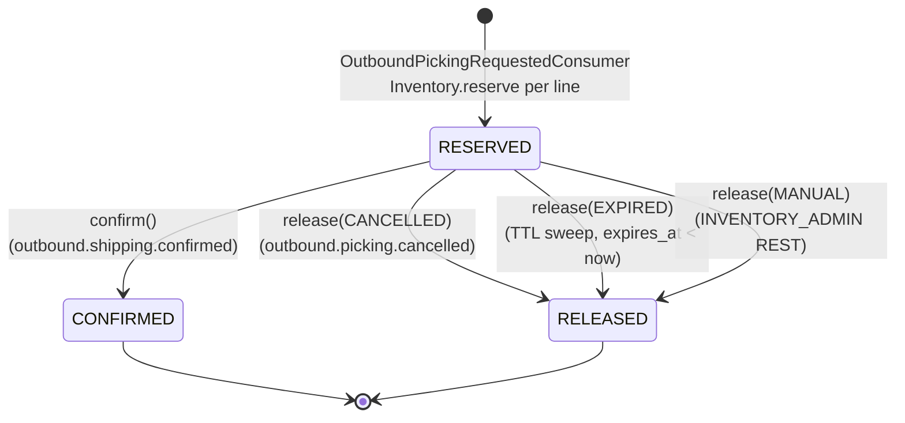

# inventory-service — Reservation State Machine

Authoritative state machine for the **Reservation** aggregate.
Implementation must match this diagram exactly. State transitions are
domain methods on `Reservation` (T4 — direct status `UPDATE` outside the
domain method path is forbidden and enforced at code-review level).

This document is referenced from
[`../architecture.md`](../architecture.md) § State Machines § Reservation
lifecycle (line 529-547),
[`../domain-model.md`](../domain-model.md) § 3 Reservation § State Machine
(line 297-308) and § State Machines (Cross-reference) (line 617-628),
and [`../sagas/reservation-saga.md`](../sagas/reservation-saga.md). For
the orchestrator-side saga machine spanning two services, see the
sibling [`../../outbound-service/state-machines/saga-status.md`](../../outbound-service/state-machines/saga-status.md).

---

## States

| State | Terminal | Triggered by | Description |
|---|---|---|---|
| `RESERVED` | no | `OutboundPickingRequestedConsumer` (Kafka, `outbound.picking.requested`) | Reservation created. Per-line `Inventory.reserve(qty, reservationId)` decremented `available_qty` and incremented `reserved_qty` on every line's row. `expires_at` set to `now + warehouse.reservation_ttl` (default 24h). Awaits `outbound.shipping.confirmed` (→ CONFIRMED), `outbound.picking.cancelled` (→ RELEASED), TTL elapse (→ RELEASED, reason `EXPIRED`), or `INVENTORY_ADMIN` manual release (→ RELEASED, reason `MANUAL`). |
| `CONFIRMED` | **yes** | `OutboundShippingConfirmedConsumer` (Kafka, `outbound.shipping.confirmed`) | Per-line `Inventory.confirm(qty, reservationId)` decremented `reserved_qty` (no paired `available` row — stock consumed, not returned). `confirmed_at` set. Emits `inventory.confirmed`. No further mutation on this row, ever. |
| `RELEASED` | **yes** | `OutboundPickingCancelledConsumer` (Kafka, reason `CANCELLED`) OR TTL sweep (`ReleaseReservationService.releaseExpired`, reason `EXPIRED`) OR `INVENTORY_ADMIN` REST manual release (reason `MANUAL`) | Per-line `Inventory.release(qty, reservationId, reason)` decremented `reserved_qty` and incremented `available_qty`. `released_reason` and `released_at` set. Emits `inventory.released`. No further mutation, ever. |

---

## Transitions

```
                    [OutboundPickingRequestedConsumer
                     creates reservation + per-line
                     Inventory.reserve(qty, reservationId)]
                                  │
                                  ▼
                          ┌──────────────┐
                          │   RESERVED   │
                          └──────┬───────┘
                                 │
            ┌────────────────────┼──────────────────────┐
            │                    │                      │
        confirm()             release()              release()
        (shipping.            (picking.              (TTL sweep OR
         confirmed)            cancelled,             INVENTORY_ADMIN
                               reason=CANCELLED)      manual,
                                                      reason=EXPIRED |
                                                      MANUAL)
            │                    │                      │
            ▼                    ▼                      ▼
    ┌──────────────┐      ┌──────────────┐      ┌──────────────┐
    │  CONFIRMED   │      │   RELEASED   │      │   RELEASED   │
    │  (terminal)  │      │  (terminal)  │      │  (terminal)  │
    └──────────────┘      └──────────────┘      └──────────────┘
```



### Per-transition rules

| From | To | Domain method | Triggering source | Side effects (atomic) | Outbox event |
|---|---|---|---|---|---|
| `RESERVED` | `CONFIRMED` | `Reservation.confirm()` | `outbound.shipping.confirmed` (Kafka) | per-line `Inventory.confirm(qty, reservationId)` → 1 Movement row (`RESERVED delta=-N`, `reason_code=SHIPPING_CONFIRMED`); set `confirmed_at=now`; bump `version` | `inventory.confirmed` |
| `RESERVED` | `RELEASED` (`CANCELLED`) | `Reservation.release(CANCELLED)` | `outbound.picking.cancelled` (Kafka) | per-line `Inventory.release(qty, reservationId, reason)` → 2 Movement rows (`RESERVED -N` + `AVAILABLE +N`, `reason_code=PICKING_CANCELLED`); set `released_reason=CANCELLED`, `released_at=now`; bump `version` | `inventory.released` |
| `RESERVED` | `RELEASED` (`EXPIRED`) | `Reservation.release(EXPIRED)` | TTL sweep job (`@Scheduled`, interval 60s, batch 200) — selects `WHERE status='RESERVED' AND expires_at < NOW()`; each row in its own `@Transactional` | per-line `Inventory.release(qty, reservationId, reason)` → 2 Movement rows (`RESERVED -N` + `AVAILABLE +N`, `reason_code=PICKING_EXPIRED`); set `released_reason=EXPIRED`; bump `version`; emit metric `inventory.reservation.expiry.swept.total += released-count` (ADR-MONO-005 § D5) | `inventory.released` |
| `RESERVED` | `RELEASED` (`MANUAL`) | `Reservation.release(MANUAL)` | `INVENTORY_ADMIN` REST manual release (`POST /api/v1/inventory/reservations/{id}:release`, `Idempotency-Key` required) | per-line `Inventory.release(qty, reservationId, reason)` → 2 Movement rows (`RESERVED -N` + `AVAILABLE +N`, `reason_code=ADJUSTMENT_RECLASSIFY` or `PICKING_CANCELLED` per ops policy); set `released_reason=MANUAL`; bump `version` | `inventory.released` |

### Forbidden transitions

| From | To | Why |
|---|---|---|
| `CONFIRMED` | any | Terminal-once: confirmed stock is consumed (W5). Restoring stock after a confirmed shipment is modelled as **new** `RECEIVE` + outbound cancellation chain, not as state regression on this row |
| `RELEASED` | any | Terminal-once: a cancelled-then-recreated picking request must use a **new** `picking_request_id` upstream (idempotency enforcement, see `domain-model.md § 3 Reservation § Invariants`) |
| `RESERVED` | `RESERVED` | Self-loop forbidden: TTL extension is **not supported in v1** (single-shot allocation lifetime per `domain-model.md § 3` invariant) |

---

## Invariants

- **Terminal-once**: both `CONFIRMED` and `RELEASED` are terminal. No
  reactivation, ever. A second `confirm()` on a `CONFIRMED` row is
  a no-op (idempotent replay); a second `release()` on a `RELEASED` row
  is a no-op. A `confirm()` on a `RELEASED` row throws
  `RESERVATION_ALREADY_RELEASED` (saga-step error → DLT, not a domain
  bug — implies a real state divergence requiring ops attention).
- **`expires_at > created_at`** at creation time (`domain-model.md § 3
  Invariants`). TTL extension is not supported in v1; once set,
  `expires_at` is immutable.
- **`picking_request_id` UNIQUE** across all Reservations regardless of
  status. The DB unique constraint, combined with terminal-once,
  guarantees Reserve is idempotent across retries (T8).
- **Cross-line warehouse equality**: all `ReservationLine`s share the
  same `warehouse_id` as the parent `Reservation` — cross-warehouse
  picking is forbidden in v1.
- **Aggregate moves whole**: line-level state is not exposed; transitions
  apply to the aggregate root, not individual lines. v1 has no
  partial-confirm / partial-release (`domain-model.md § 3 Reservation
  § Aggregate Shape`).
- **Bucket coupling**: while `status = RESERVED`, every line's
  `inventory.reserved_qty >= line.quantity` must hold. Enforced by:
  Reserve increments, Release / Confirm decrement, and OL on
  `Inventory.version` prevents racy bucket mutation.
- **`released_reason` non-null iff `status = RELEASED`**; null otherwise.
  `confirmed_at` non-null iff `status = CONFIRMED`. `released_at`
  non-null iff `status = RELEASED`.

---

## Forbidden Patterns (in code)

- ❌ Direct `UPDATE reservation SET status = ...` outside the domain
  method path (T4). Status mutations must go through `confirm()` or
  `release(reason)`.
- ❌ Direct mutation of `released_reason` / `confirmed_at` / `released_at`
  outside the domain method path.
- ❌ Domain method invocation that bypasses the parallel
  `Inventory.release / confirm` calls — saga atomicity (T7) requires
  the aggregate transition and the bucket mutations commit in the same
  `@Transactional`. Splitting them is forbidden.
- ❌ Reactivation: any code path that sets a terminal row back to
  `RESERVED`. Restoring stock is a new RECEIVE, not a state regression.
- ❌ Partial confirm / partial release: line-level status mutation.
  v1 simplification (per `domain-model.md § 3 § Aggregate Shape`).
- ❌ TTL extension: any code path that mutates `expires_at` after
  creation. v1 single-shot allocation.

---

## References

- [`../architecture.md`](../architecture.md) — § State Machines §
  Reservation lifecycle (line 529-547), § Saga / Long-running Flow §
  Category D reference (line 517-525).
- [`../domain-model.md`](../domain-model.md) — § 3 Reservation § State
  Machine (line 297-308), § 3 § Invariants (line 320-339), § 3 §
  Quantity-mismatch Handling (line 340-345), § State Machines
  (Cross-reference) (line 617-628).
- [`../sagas/reservation-saga.md`](../sagas/reservation-saga.md) —
  companion saga document; per-operation atomic actions, compensation
  rule, observability.
- [`../../outbound-service/state-machines/saga-status.md`](../../outbound-service/state-machines/saga-status.md)
  — sibling state-machine pattern (orchestrator-side; this file uses
  the same shape).
- [`../../../contracts/events/inventory-events.md`](../../../contracts/events/inventory-events.md)
  — § 4 `inventory.reserved`, § 5 `inventory.released`, § 6
  `inventory.confirmed` payload schemas emitted on each transition.
- [`../../../../../rules/traits/transactional.md`](../../../../../rules/traits/transactional.md)
  — T4 (no direct status UPDATE), T7 (saga atomicity), T5 (optimistic
  lock).
- [`../../../../../rules/domains/wms.md`](../../../../../rules/domains/wms.md)
  — W4 (reserve→confirm), W5 (no decrement until shipped).
- [`../../../../../docs/adr/ADR-MONO-005-saga-timeout-escalation-dead-letter-policy.md`](../../../../../docs/adr/ADR-MONO-005-saga-timeout-escalation-dead-letter-policy.md)
  — § D6 (TTL Category D reference implementation), § D5 (counter
  contract).
