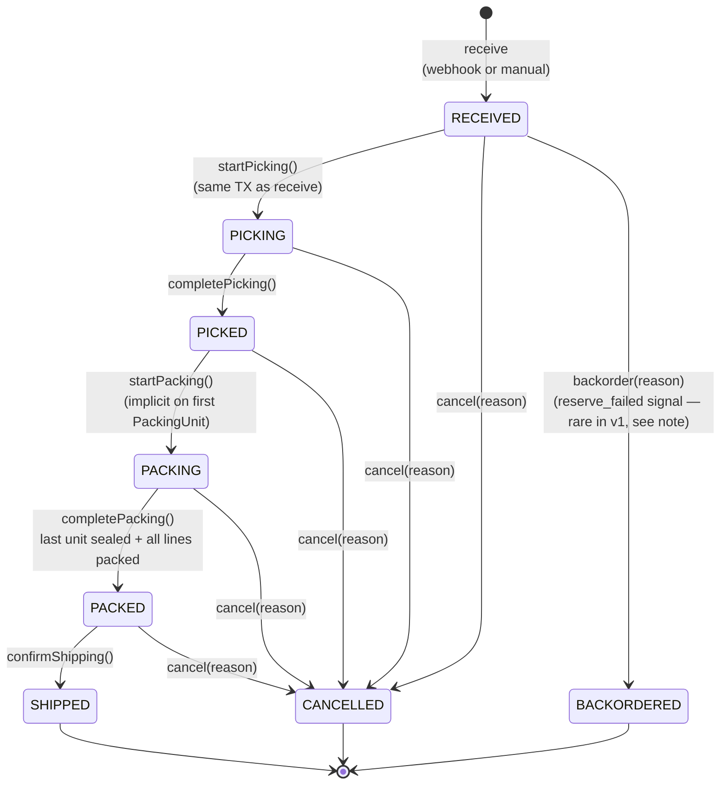

# outbound-service — Order State Machine

Authoritative state machine for the **Order** aggregate root. Implementation
must match this diagram exactly. State transitions are domain methods (T4 —
direct status `UPDATE` is forbidden).

Consumers: `ReceiveOrderUseCase`, `ConfirmPickingUseCase`,
`CreatePackingUnitUseCase`, `SealPackingUnitUseCase`,
`ConfirmShippingUseCase`, `CancelOrderUseCase`. The webhook ingest path and
manual REST creation both terminate in `ReceiveOrderUseCase`, which produces
an Order that is created in `RECEIVED` and **immediately** advanced to
`PICKING` by the same use-case (atomic — Phase 1 of
[`../workflows/outbound-flow.md`](../workflows/outbound-flow.md)).

This document is referenced from
[`../architecture.md`](../architecture.md) § Concurrency Control and
[`../domain-model.md`](../domain-model.md) §1 Order.

The Order state machine is **independent** of the OutboundSaga state
machine — both progress in lock-step but are tracked separately. See
[`saga-status.md`](saga-status.md) for the saga side.

---

## States

| State | Terminal | Description |
|---|---|---|
| `RECEIVED` | no | Order received via webhook or manual REST. OrderLines are mutable for the brief window before `startPicking()` runs (in v1, the same use-case advances to `PICKING` immediately, so callers never observe an Order resting in `RECEIVED`). |
| `PICKING` | no | Picking has been requested; saga is in `REQUESTED` or `RESERVED`. OrderLines become **immutable** from this state forward. Cancellation still allowed. |
| `PICKED` | no | Operator has confirmed all picks; saga is in `PICKING_CONFIRMED`. PickingConfirmation rows exist. Awaiting packing. |
| `PACKING` | no | At least one PackingUnit has been created; not all units sealed or not all lines fully packed. |
| `PACKED` | no | All PackingUnits are SEALED and all lines are fully accounted for. Awaiting shipping confirmation. Saga is in `PACKING_CONFIRMED`. |
| `SHIPPED` | **yes** | Shipping confirmed; Shipment created; saga in `SHIPPED`/`SHIPPED_NOT_NOTIFIED`/`COMPLETED`. **Cancellation forbidden** — returns/RMA is v2. |
| `CANCELLED` | **yes** | Order cancelled before shipping. Inventory reservations released via compensation saga (if any existed). |
| `BACKORDERED` | **yes** | Reserve failed (insufficient stock). Order will not progress; ops creates a follow-up order or notifies customer. |

---

## Transitions

```
        ┌──────────────────────────────────┐
        │       [receive (webhook/manual)] │
        └────────────────┬─────────────────┘
                         ▼
                    ┌──────────┐
            ┌──────▶│ RECEIVED │──────────────┐
            │       └────┬─────┘              │
            │            │ startPicking       │ backorder
            │            │ (in same TX as     │ (reserve_failed signal)
            │ cancel     │  ReceiveOrderUseCase)
            │            ▼                    ▼
            │       ┌──────────┐         ┌─────────────┐
            │       │ PICKING  │────────▶│ BACKORDERED │
            │       └────┬─────┘         │ (terminal)  │
            │            │ completePicking└─────────────┘
            │            ▼
            │       ┌──────────┐
            │       │  PICKED  │
            │       └────┬─────┘
            │            │ startPacking
            │            │ (implicit: first PackingUnit creation)
            │            ▼
            │       ┌──────────┐
            │       │ PACKING  │
            │       └────┬─────┘
            │            │ completePacking
            │            │ (last unit sealed AND all lines fully packed)
            │            ▼
            │       ┌──────────┐
            │       │  PACKED  │
            │       └────┬─────┘
            │            │ confirmShipping
            │            ▼
            │       ┌──────────┐
            │       │ SHIPPED  │
            │       │ (terminal)
            │       └──────────┘
            │
            │ cancel    (any state ∈ {RECEIVED, PICKING, PICKED, PACKING, PACKED})
            ▼
        ┌───────────┐
        │ CANCELLED │
        │ (terminal)│
        └───────────┘

       (any non-listed transition or cancel from SHIPPED/CANCELLED/BACKORDERED)
            → STATE_TRANSITION_INVALID (422)
            → ORDER_ALREADY_SHIPPED (422) for cancel-after-SHIPPED
```

**Mermaid:**



> **Note on `RECEIVED → BACKORDERED`**: In v1 the `RECEIVED` state is
> transient — `ReceiveOrderUseCase` advances to `PICKING` in the same TX.
> The reserve-failed signal arrives later (Kafka consumer of
> `inventory.adjusted{reason=INSUFFICIENT_STOCK}`), at which point the
> Order is in `PICKING`. The `backorder()` method is therefore **also
> allowed from `PICKING`**, transitioning to `BACKORDERED` (terminal).
> This is documented in the Transition Rules table below.

---

## Transition Rules

| From | To | Method | Trigger | Side-effects |
|---|---|---|---|---|
| (none) | `RECEIVED` | `Order.receive(...)` factory | Webhook ingest or `POST /orders` | Outbox: `outbound.order.received`. In the same TX, the use-case immediately calls `startPicking()` |
| `RECEIVED` | `PICKING` | `Order.startPicking()` | `ReceiveOrderUseCase` (same TX as receive) | Atomic with PickingRequest creation, OutboundSaga creation (`REQUESTED`), and Outbox: `outbound.picking.requested` |
| `PICKING` | `PICKED` | `Order.completePicking(actorId)` | `ConfirmPickingUseCase` finalises PickingConfirmation | Atomic with Saga → `PICKING_CONFIRMED` and Outbox: `outbound.picking.completed` |
| `PICKED` | `PACKING` | `Order.startPacking()` | First `CreatePackingUnitUseCase` invocation | None (intermediate state; outbox fires only on completion) |
| `PACKING` | `PACKED` | `Order.completePacking()` | `SealPackingUnitUseCase` when last unit is SEALED AND all lines fully packed | Atomic with Saga → `PACKING_CONFIRMED` and Outbox: `outbound.packing.completed` |
| `PACKED` | `SHIPPED` | `Order.confirmShipping(actorId)` | `ConfirmShippingUseCase` | Atomic with Shipment creation, Saga → `SHIPPED`, and Outbox: `outbound.shipping.confirmed`. After-commit hook triggers async TMS push |
| `RECEIVED` / `PICKING` / `PICKED` / `PACKING` / `PACKED` | `CANCELLED` | `Order.cancel(reason, actorId)` | `CancelOrderUseCase` | Atomic with Saga state transition (→ `CANCELLATION_REQUESTED` if reservation existed, else direct `CANCELLED`) and Outbox: `outbound.order.cancelled` (and `outbound.picking.cancelled` if reservation existed) |
| `RECEIVED` / `PICKING` | `BACKORDERED` | `Order.backorder(reason)` | `InventoryAdjustedConsumer` (filtered: `INSUFFICIENT_STOCK`) | Atomic with Saga → `RESERVE_FAILED` and Outbox: `outbound.order.cancelled` (carries `reason=BACKORDERED`) |

Any other invocation throws `StateTransitionInvalidException` → HTTP 422
`STATE_TRANSITION_INVALID`. Cancellation from `SHIPPED` throws
`OrderAlreadyShippedException` → HTTP 422 `ORDER_ALREADY_SHIPPED` (a
business-friendly code distinct from the generic state error).

---

## Guard Conditions

These pre-conditions are checked **inside** the domain method before the
state transition. Failing a guard throws a domain exception, NOT
`STATE_TRANSITION_INVALID`.

| Transition | Guard | Failure code |
|---|---|---|
| `(none) → RECEIVED` | `customer_partner_id` resolves to ACTIVE Partner with `partner_type ∈ {CUSTOMER, BOTH}` per MasterReadModel | `PARTNER_INVALID_TYPE` (422) |
| `(none) → RECEIVED` | All `sku_id`s ACTIVE per MasterReadModel | `SKU_INACTIVE` (422) |
| `(none) → RECEIVED` | All lines belong to same `warehouse_id` | `WAREHOUSE_MISMATCH` (422) |
| `(none) → RECEIVED` | LOT-tracked SKU lines with explicit `lot_id` resolve to ACTIVE non-EXPIRED Lot | `LOT_REQUIRED` (422) when missing; `LOT_INVALID` (422) when stale |
| `(none) → RECEIVED` | At least one OrderLine | `VALIDATION_ERROR` (422) |
| `RECEIVED → PICKING` | At least one OrderLine and `customer_partner_id` still ACTIVE | `VALIDATION_ERROR` (should not trigger — validated at receive) |
| `PICKING → PICKED` | One PickingConfirmation per OrderLine; `qty_confirmed == qty_ordered` for each line; LOT supplied for LOT-tracked SKUs | `PICKING_QUANTITY_MISMATCH`, `LOT_REQUIRED`, or `PICKING_INCOMPLETE` (422) |
| `PICKED → PACKING` | (none — implicit on first PackingUnit creation) | — |
| `PACKING → PACKED` | For each `order_line`: `sum(packing_unit_line.qty) == order_line.qty_ordered`; all PackingUnits are SEALED | `PACKING_INCOMPLETE` (422) |
| `PACKED → SHIPPED` | (no OrderLine count guard — already ensured at PACKED). `actorId` has role `OUTBOUND_WRITE` or `OUTBOUND_ADMIN` | `FORBIDDEN` (403) — checked at application layer |
| `* → CANCELLED` | `from ∈ {RECEIVED, PICKING, PICKED, PACKING, PACKED}`. `actorId` has role `OUTBOUND_ADMIN` | `ORDER_ALREADY_SHIPPED` (422) for cancel-from-SHIPPED; `STATE_TRANSITION_INVALID` for cancel-from-CANCELLED/BACKORDERED; `FORBIDDEN` (403) for missing role |
| `RECEIVED / PICKING → BACKORDERED` | Triggered by inventory `INSUFFICIENT_STOCK` event only — NOT from REST | (Kafka consumer; never surfaces a 4xx) |

---

## Concurrency

- Optimistic lock: `Order.version` (T5).
- Two operators racing on the same Order: the second commit gets
  `CONFLICT` (409). The application MUST NOT auto-retry state
  transitions — the caller refetches the aggregate and re-evaluates
  whether the action is still valid in the new state.
- Cross-aggregate atomicity: `Order` transitions in `ConfirmPickingUseCase`,
  `SealPackingUnitUseCase` (final), `ConfirmShippingUseCase`,
  `CancelOrderUseCase` happen **in the same TX** as `OutboundSaga`
  transitions and outbox writes (per T7 saga atomicity). All three
  aggregates carry their own `version` columns and may independently
  raise `OptimisticLockingFailureException` — the entire TX rolls back on
  any conflict.
- Race between REST cancel and Kafka inventory.reserved on Phase 2:
  - REST cancel loads Order at v0 and Saga at v0.
  - Kafka consumer loads Saga at v0 (Order not touched).
  - First commit (whichever) wins at v1. The loser sees
    `OptimisticLockingFailureException`. REST returns 409 `CONFLICT`;
    Kafka consumer retries. On retry, the Saga state-machine guard
    handles the now-invalid transition idempotently. See
    [`saga-status.md`](saga-status.md) § Concurrency for details.

---

## Reverse / Compensation Flows (v1)

Once `SHIPPED` is entered:

- ❌ **Cancellation forbidden**: any cancel attempt → `ORDER_ALREADY_SHIPPED`
  (422). Returns / RMA is v2 (creates a separate inbound RMA flow).
- ❌ **Mutation forbidden**: Shipment, OrderLines, PackingUnits all immutable
  (Shipment allows updates only to `tms_status`/`tracking_no`/
  `tms_notified_at` — these are vendor-driven side-channel updates, not
  domain mutations).
- ❌ **No reverse picking** in v1 — un-confirming a `PickingConfirmation`
  not supported. To correct an erroneous confirmation, ops creates a
  cancellation (which compensates the inventory reservation) and a fresh
  Order.

Cancellation from non-SHIPPED states **is** the compensation path for the
saga; see [`../sagas/outbound-saga.md`](../sagas/outbound-saga.md) §
Compensation Paths.

---

## Error-Code Mapping (controller → response)

| Domain exception | HTTP | Code |
|---|---|---|
| `StateTransitionInvalidException` | 422 | `STATE_TRANSITION_INVALID` |
| `OrderAlreadyShippedException` | 422 | `ORDER_ALREADY_SHIPPED` |
| `PickingIncompleteException` | 422 | `PICKING_INCOMPLETE` |
| `PickingQuantityMismatchException` | 422 | `PICKING_QUANTITY_MISMATCH` |
| `PackingIncompleteException` | 422 | `PACKING_INCOMPLETE` |
| `PackingQuantityExceededException` | 422 | `PACKING_QUANTITY_EXCEEDED` |
| `PartnerInvalidTypeException` | 422 | `PARTNER_INVALID_TYPE` |
| `SkuInactiveException` | 422 | `SKU_INACTIVE` |
| `WarehouseMismatchException` | 422 | `WAREHOUSE_MISMATCH` |
| `LotRequiredException` | 422 | `LOT_REQUIRED` |
| `OrderNoDuplicateException` | 409 | `ORDER_NO_DUPLICATE` |
| `OptimisticLockingFailureException` | 409 | `CONFLICT` |
| `OrderNotFoundException` | 404 | `ORDER_NOT_FOUND` |

Full registry: `platform/error-handling.md` § Outbound `[domain: wms]`.

---

## Test Requirements

Per [`../architecture.md`](../architecture.md) § Testing Requirements:

- **Unit (Domain)**: every transition listed in the table above + every
  `STATE_TRANSITION_INVALID` case (the cross-product minus the legal
  arrows). Each guard condition must have its own failing test.
- **Application Service**: each use-case verifies that a successful
  invocation writes exactly one outbox row (or N rows when atomically
  required, e.g., Phase 1 writes two: `outbound.order.received` and
  `outbound.picking.requested`) in the same `@Transactional` boundary as
  the status change AND the saga transition.
- **Persistence Adapter**: optimistic-lock conflict on `Order.version`.
- **Failure-mode**:
  - cancel-after-SHIPPED → `ORDER_ALREADY_SHIPPED`
  - completePicking with mismatched qty → `PICKING_QUANTITY_MISMATCH`
  - completePacking with sum < ordered → `PACKING_INCOMPLETE`
  - confirmShipping from PICKING (skip steps) → `STATE_TRANSITION_INVALID`
  - cancel-from-CANCELLED → `STATE_TRANSITION_INVALID`
  - reserve_failed event → `BACKORDERED` reached, single outbox emission

---

## References

- [`../architecture.md`](../architecture.md) § Concurrency Control / State
  Machine
- [`../domain-model.md`](../domain-model.md) §1 Order
- [`saga-status.md`](saga-status.md) — saga state machine (independent but
  parallel)
- [`../workflows/outbound-flow.md`](../workflows/outbound-flow.md) —
  narrative walk-through
- [`../sagas/outbound-saga.md`](../sagas/outbound-saga.md) — saga document
- [`../idempotency.md`](../idempotency.md) — REST + saga-level dedupe
- `rules/traits/transactional.md` — T4 (no direct status update), T5
  (optimistic lock), T7 (saga atomicity)
- `rules/domains/wms.md` § Standard Error Codes (Outbound)
- `platform/error-handling.md` — registry of error codes
- `specs/contracts/events/outbound-events.md` — outbox events fired per
  transition (Open Item)
