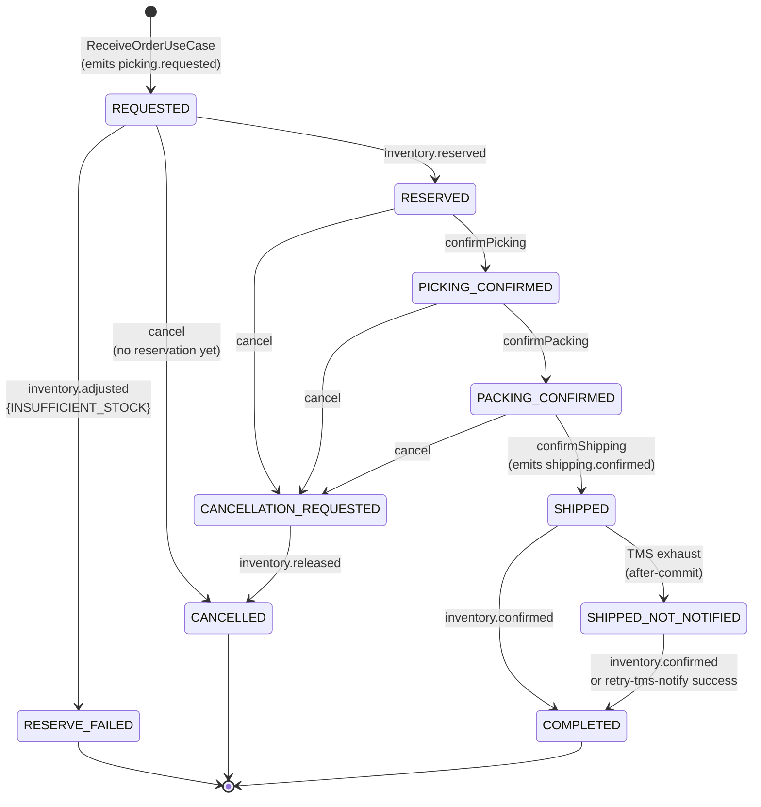

# outbound-service — OutboundSaga State Machine

Authoritative state machine for the **OutboundSaga** aggregate.
Implementation must match this diagram exactly. State transitions are
domain methods on `OutboundSaga` (T4 — direct status `UPDATE` is
forbidden).

The saga is the **state-keeping orchestrator** of the choreographed
outbound flow spanning `outbound-service` ↔ `inventory-service`. The saga
state machine is **independent** of the Order state machine but progresses
in lock-step: outbound use-cases mutate both aggregates inside the same
`@Transactional` boundary (per T7 saga atomicity).

This document is referenced from
[`../architecture.md`](../architecture.md) § Outbound Saga,
[`../domain-model.md`](../domain-model.md) §6 OutboundSaga, and
[`../sagas/outbound-saga.md`](../sagas/outbound-saga.md). For the parallel
Order machine, see [`order-status.md`](order-status.md).

---

## States

| State | Terminal | Triggered by | Description |
|---|---|---|---|
| `REQUESTED` | no | `ReceiveOrderUseCase` (REST/webhook) | Saga created. `outbound.picking.requested` event has been written to outbox. Awaiting `inventory.reserved`. |
| `RESERVED` | no | `InventoryReservedConsumer` (Kafka) | Inventory reserved successfully. Awaiting operator pick confirmation. |
| `PICKING_CONFIRMED` | no | `ConfirmPickingUseCase` (REST) | Operator confirmed picks. Order in `PICKED`. Awaiting packing. |
| `PACKING_CONFIRMED` | no | `SealPackingUnitUseCase` (REST, last seal) | All units sealed; order fully packed. Order in `PACKED`. Awaiting shipping confirmation. |
| `SHIPPED` | no | `ConfirmShippingUseCase` (REST) | Shipment created; `outbound.shipping.confirmed` published. Awaiting `inventory.confirmed` AND TMS ack. |
| `COMPLETED` | **yes** | `InventoryConfirmedConsumer` (Kafka) | Inventory consumed reserved stock. Saga done. (TMS may still be pending — independent side-channel on Shipment.) |
| `RESERVE_FAILED` | **yes** | `InventoryAdjustedConsumer` filtered: `INSUFFICIENT_STOCK` | Inventory could not reserve. Order moved to `BACKORDERED`. No compensation emitted (all-or-nothing reserve — no resources held). |
| `CANCELLATION_REQUESTED` | no | `CancelOrderUseCase` from `RESERVED`/`PICKING_CONFIRMED`/`PACKING_CONFIRMED` | Cancel issued; `outbound.picking.cancelled` written to outbox. Awaiting `inventory.released`. |
| `CANCELLED` | **yes** | `InventoryReleasedConsumer` (Kafka), OR `CancelOrderUseCase` directly when saga was still `REQUESTED` (no reservation exists) | Compensation complete. Saga done. |
| `SHIPPED_NOT_NOTIFIED` | no (alert) | TMS retry exhaustion (after-commit handler) | Shipment was published to outbox + `inventory.confirmed` may have arrived; TMS push failed after retry/circuit/bulkhead exhaustion. Stock already consumed. Stays here until manual `:retry-tms-notify` succeeds (→ `COMPLETED` if `inventory.confirmed` arrived) or operator force-completes. |

---

## Transitions

```
                  [ReceiveOrderUseCase
                   creates saga + emits picking.requested]
                                │
                                ▼
                        ┌──────────────┐
                        │  REQUESTED   │
                        └──────┬───────┘
                               │ inventory.reserved (Kafka)
                               │
                ┌──────────────┴───────────────┐
                │                              │
                │ inventory.adjusted{INSUFFICIENT_STOCK} (Kafka)
                │                              │
                ▼                              ▼
        ┌──────────────┐               ┌──────────────┐
        │RESERVE_FAILED│               │   RESERVED   │
        │  (terminal)  │               └──────┬───────┘
        └──────────────┘                      │
                                              │ confirmPicking (REST)
                                              ▼
                                       ┌──────────────────┐
                                       │PICKING_CONFIRMED │
                                       └──────┬───────────┘
                                              │ confirmPacking
                                              │ (last seal in same use-case)
                                              ▼
                                       ┌──────────────────┐
                                       │PACKING_CONFIRMED │
                                       └──────┬───────────┘
                                              │ confirmShipping (REST)
                                              │ + emit outbound.shipping.confirmed
                                              ▼
                                       ┌──────────┐
                                       │ SHIPPED  │
                                       └────┬─────┘
                                            │
                  ┌─────────────────────────┴─────────────────────────┐
                  │ inventory.confirmed                  TMS exhaust  │
                  │ (Kafka)                              (after-commit)
                  ▼                                                   ▼
            ┌──────────────┐                              ┌──────────────────────┐
            │  COMPLETED   │                              │ SHIPPED_NOT_NOTIFIED │
            │  (terminal)  │                              │      (alert)         │
            └──────────────┘                              └──────────┬───────────┘
                  ▲                                                   │
                  │                          inventory.confirmed      │
                  │                          (or :retry-tms-notify    │
                  │                           succeeds + sweeper)     │
                  └───────────────────────────────────────────────────┘

                                  CANCELLATION PATH

   [CancelOrderUseCase from {RESERVED, PICKING_CONFIRMED, PACKING_CONFIRMED}]
                          │
                          │ emit outbound.picking.cancelled
                          ▼
              ┌───────────────────────────┐
              │  CANCELLATION_REQUESTED   │
              └────────────┬──────────────┘
                           │ inventory.released (Kafka)
                           ▼
                    ┌──────────────┐
                    │  CANCELLED   │
                    │  (terminal)  │
                    └──────────────┘

   [CancelOrderUseCase from REQUESTED → directly to CANCELLED — no reservation to release]
```

**Mermaid:**



---

## Transition Rules

| From | To | Trigger | EventId Dedupe? | Optimistic Lock? | Side-effects |
|---|---|---|---|---|---|
| (none) | `REQUESTED` | `ReceiveOrderUseCase` (REST/webhook background) | n/a | new row | Atomic with Order creation, PickingRequest creation, Outbox: `outbound.order.received` + `outbound.picking.requested` |
| `REQUESTED` | `RESERVED` | `InventoryReservedConsumer` consumes `inventory.reserved` | YES (`outbound_event_dedupe`) | YES (Saga.version++) | PickingRequest.status → `SUBMITTED`. No outbox row (REST drives next step) |
| `REQUESTED` | `RESERVE_FAILED` | `InventoryAdjustedConsumer` consumes `inventory.adjusted` filtered to `reason=INSUFFICIENT_STOCK` | YES | YES | Order.backorder() → `BACKORDERED`. Outbox: `outbound.order.cancelled` (carries `reason=BACKORDERED`) |
| `REQUESTED` | `CANCELLED` | `CancelOrderUseCase` (REST) — no reservation yet exists | n/a | YES | Order.cancel() → `CANCELLED`. Outbox: `outbound.order.cancelled` ONLY (no `picking.cancelled` because no reservation) |
| `RESERVED` | `PICKING_CONFIRMED` | `ConfirmPickingUseCase` (REST) | n/a (REST) | YES | Atomic with Order.completePicking() → `PICKED`, PickingConfirmation creation, Outbox: `outbound.picking.completed` |
| `RESERVED` / `PICKING_CONFIRMED` / `PACKING_CONFIRMED` | `CANCELLATION_REQUESTED` | `CancelOrderUseCase` (REST) | n/a | YES | Atomic with Order.cancel() → `CANCELLED`, Outbox: `outbound.picking.cancelled` + `outbound.order.cancelled` |
| `PICKING_CONFIRMED` | `PACKING_CONFIRMED` | `SealPackingUnitUseCase` (REST, final seal completing all lines) | n/a | YES | Atomic with Order.completePacking() → `PACKED`, Outbox: `outbound.packing.completed` |
| `PACKING_CONFIRMED` | `SHIPPED` | `ConfirmShippingUseCase` (REST) | n/a | YES | Atomic with Order.confirmShipping() → `SHIPPED`, Shipment creation (`tms_status=PENDING`), Outbox: `outbound.shipping.confirmed`. After-commit: TMS push |
| `SHIPPED` | `COMPLETED` | `InventoryConfirmedConsumer` consumes `inventory.confirmed` | YES | YES | No outbox row (terminal, no downstream wait) |
| `SHIPPED` | `SHIPPED_NOT_NOTIFIED` | TMS retry / circuit / bulkhead exhaustion (after-commit handler) | n/a (TMS, not Kafka) | YES | Shipment.tms_status → `NOTIFY_FAILED`, failure_reason populated. Alert fires. No outbox row |
| `SHIPPED_NOT_NOTIFIED` | `COMPLETED` | (a) `InventoryConfirmedConsumer`, OR (b) `RetryTmsNotifyUseCase` success + already-received `inventory.confirmed` | YES (a only) | YES | Shipment.tms_status → `NOTIFIED` (b only). No outbox row |
| `CANCELLATION_REQUESTED` | `CANCELLED` | `InventoryReleasedConsumer` consumes `inventory.released` | YES | YES | No outbox row |

> Direct `UPDATE outbound_saga SET state = ?` is **forbidden** (T4). Only
> `OutboundSaga.apply(event)` or `OutboundSaga.transitionTo(state)`
> mutates state.

---

## Re-Delivery Behavior (Saga-Level Idempotency)

The saga state machine is the **fourth idempotency layer** (see
[`../idempotency.md`](../idempotency.md) §4). Even when EventId dedupe
fails to absorb a re-delivery (e.g., a saga sweeper re-emits with a fresh
eventId, or the 30-day dedupe TTL has expired), the state machine **must**
silently no-op already-applied transitions.

`OutboundSaga.apply(event)` distinguishes three cases:

| Case | Behavior |
|---|---|
| Legal transition (event matches current state) | Advance state, increment version, return |
| Already-applied (event matches a **prior** state) | **Silent no-op** — log INFO `saga_event_already_applied`, return without modifying anything |
| Genuinely impossible (event matches no state on the path, e.g., `inventory.confirmed` while saga is in `REQUESTED`) | Log WARN `saga_event_invalid_transition`, throw `StateTransitionInvalidException` (Kafka path: message goes to DLT after retries; REST path: surfaces as 422) |

### Already-Applied Pairs (silent no-op)

| Current state | Event kind | Reason |
|---|---|---|
| `RESERVED`, `PICKING_CONFIRMED`, `PACKING_CONFIRMED`, `SHIPPED`, `SHIPPED_NOT_NOTIFIED`, `COMPLETED` | `inventory.reserved` | Saga already past reserve step (sweeper re-emit landed) |
| `COMPLETED` | `inventory.confirmed` | Saga already completed (broker redelivery with fresh id) |
| `CANCELLED` | `inventory.released` | Saga already cancelled |
| `RESERVE_FAILED` | `inventory.released` | Reserve failed (no reservation existed); release event spurious — log INFO no-op for safety |

### Genuinely Impossible Pairs (DLT-bound)

| Current state | Event kind | Reason |
|---|---|---|
| `REQUESTED` | `inventory.confirmed` | Confirm before Reserve — protocol violation |
| `REQUESTED` | `inventory.released` | Release without preceding cancel — protocol violation |
| `RESERVE_FAILED` | `inventory.reserved` | Inventory contradicts itself — alert |
| `RESERVE_FAILED` | `inventory.confirmed` | Same — alert |
| `CANCELLED` (terminal) | `inventory.reserved` / `inventory.confirmed` | Saga already terminal in failure state |
| `COMPLETED` (terminal) | `inventory.released` | Released after completed — protocol violation |

These cases log WARN and the message is routed to DLT after retries. Ops
investigates via the per-vendor runbook.

---

## Concurrency

### Optimistic Lock

`OutboundSaga.version` (T5). Every transition increments `version`.
Concurrent transitions on the same saga raise
`OptimisticLockingFailureException` on the second commit.

### Race: REST Cancel vs Kafka inventory.reserved

A frequent and important race when the operator cancels right as
inventory's reserve completes.

```
T0: saga = REQUESTED, version V
T1: REST POST /orders/{id}:cancel arrives.
    Loads saga at V. Cancel from REQUESTED is legal — would transition to CANCELLED directly.
T2: InventoryReservedConsumer polls. Loads saga at V.
    Reserved from REQUESTED is legal — would transition to RESERVED.
T3: First commit succeeds at V+1.
T4: Second commit attempts at V — OptimisticLockingFailureException.
T5a (REST won, Kafka lost): consumer retries on next poll. Loads saga at V+1 = CANCELLED.
                           Transition (CANCELLED, inventory.reserved) is GENUINELY IMPOSSIBLE — DLT.
                           Operator-side: pre-pick cancel before reserve completed; reservation never existed.
                           Inventory will receive eventually-consistent timing — its own logic creates a
                           reservation and emits inventory.reserved with a sagaId that points at a CANCELLED
                           saga in outbound. The DLT fires; ops invokes a manual release on inventory.
                           (This is rare but documented.)
T5b (Kafka won, REST lost): REST returns 409 CONFLICT. Caller refetches; sees saga = RESERVED.
                            Re-issues cancel. New TX: cancel from RESERVED → CANCELLATION_REQUESTED → emit
                            outbound.picking.cancelled. Inventory releases. Saga → CANCELLED.
                            Correct end state, with one extra round-trip.
```

The race is **resolved by retries + state-machine guard**, never by
locking. Pessimistic locks are forbidden (T5).

### Race: REST Cancel vs Kafka inventory.confirmed (post-ship)

Cancellation from `SHIPPED` is forbidden in v1 (`ORDER_ALREADY_SHIPPED`),
so this race cannot manifest.

### Race: Two REST Operators on the Same Saga

Two operators issuing `confirmPicking` on the same Order at the same time:
first commits at v+1 (saga `RESERVED → PICKING_CONFIRMED`). Second sees
`OptimisticLockingFailureException` → 409 `CONFLICT`. Caller refetches;
saga is now `PICKING_CONFIRMED`. Re-issuing the same call sees saga state
`PICKING_CONFIRMED` (not `RESERVED`) → `STATE_TRANSITION_INVALID`. Caller
recognises "someone else already confirmed" and stops.

### Forbidden

- Pessimistic locks (T5)
- Distributed transactions (T2)
- `UPDATE outbound_saga SET state = ?` directly (T4)

---

## Saga Sweeper (Recovery)

Background job (every 60s; uses `FOR UPDATE SKIP LOCKED` to coordinate
across pods). For each transitional state with stale `last_transition_at`:

| Stuck state | Threshold | Action |
|---|---|---|
| `REQUESTED` | > 5 min | Re-emit `outbound.picking.requested` to outbox (fresh eventId) |
| `CANCELLATION_REQUESTED` | > 5 min | Re-emit `outbound.picking.cancelled` |
| `SHIPPED` | > 5 min without `inventory.confirmed` dedupe row | Re-emit `outbound.shipping.confirmed` |

The sweeper does NOT re-emit for `SHIPPED_NOT_NOTIFIED` — TMS recovery is
operator-initiated via `:retry-tms-notify`.

Re-emission produces a fresh Kafka envelope `eventId`. The downstream
inventory-service consumer absorbs via its own dedupe (if within 30 days) or
its own reservation-id UNIQUE constraint. When inventory replies, the
outbound saga consumer absorbs via the state-machine guard (already-applied
no-op).

See [`../sagas/outbound-saga.md`](../sagas/outbound-saga.md) § Saga
Recovery for the full sweeper specification.

---

## Order State Coupling

Saga transitions and Order transitions are tied together inside the same
use-case TX. The table below shows the parallel state movement:

| Saga transition | Order transition (same TX) |
|---|---|
| `(none) → REQUESTED` | `(none) → RECEIVED → PICKING` (atomic startPicking) |
| `REQUESTED → RESERVED` | (none — Order stays `PICKING`) |
| `RESERVED → PICKING_CONFIRMED` | `PICKING → PICKED` |
| `PICKING_CONFIRMED → PACKING_CONFIRMED` | `PICKED → PACKING → PACKED` (within `SealPackingUnitUseCase`; `startPacking` happened earlier on first unit creation) |
| `PACKING_CONFIRMED → SHIPPED` | `PACKED → SHIPPED` |
| `SHIPPED → COMPLETED` | (none — Order stays `SHIPPED`) |
| `SHIPPED → SHIPPED_NOT_NOTIFIED` | (none — Order stays `SHIPPED`; only Shipment.tms_status changes) |
| `SHIPPED_NOT_NOTIFIED → COMPLETED` | (none) |
| `REQUESTED → RESERVE_FAILED` | `PICKING → BACKORDERED` |
| `* → CANCELLATION_REQUESTED` | `* → CANCELLED` (Order moves to terminal CANCELLED immediately; saga still has work to do — release reservation) |
| `CANCELLATION_REQUESTED → CANCELLED` | (none — Order already CANCELLED) |
| `REQUESTED → CANCELLED` (no-reservation cancel path) | `PICKING → CANCELLED` |

> **Subtlety**: When cancellation triggers compensation, the **Order**
> is marked `CANCELLED` immediately (operator perspective: "the order is
> cancelled, customer notified"). The **saga** still has the
> compensation work to do (`CANCELLATION_REQUESTED → CANCELLED`). This
> separation lets the operator UI show "cancelled" promptly without
> waiting for the inventory-service round-trip.

---

## Error-Code Mapping (controller / consumer → response)

| Domain exception | Caused by | HTTP (REST) / Kafka behavior |
|---|---|---|
| `StateTransitionInvalidException` | Genuinely impossible saga transition | 422 `STATE_TRANSITION_INVALID` (REST); DLT after retries (Kafka) |
| `OptimisticLockingFailureException` | Concurrent saga update | 409 `CONFLICT` (REST); retry + saga-guard absorb (Kafka) |
| `OrderAlreadyShippedException` | Cancel on SHIPPED order | 422 `ORDER_ALREADY_SHIPPED` |
| (silent no-op for already-applied) | Re-delivery | INFO log; no error |

Full registry: `platform/error-handling.md` § Outbound `[domain: wms]`.

---

## Test Requirements

Per [`../architecture.md`](../architecture.md) § Testing Requirements:

- **Unit (Domain — `OutboundSaga` aggregate)**:
  - Every legal transition listed in the table above
  - Every `STATE_TRANSITION_INVALID` case (cross-product minus legal)
  - Every already-applied pair returns silently
  - Version increments on every successful transition
- **Application Service (port fakes)**:
  - SagaCoordinator happy path: REQUESTED → RESERVED → PICKING_CONFIRMED
    → PACKING_CONFIRMED → SHIPPED → COMPLETED
  - Reserve-failed branch: REQUESTED → RESERVE_FAILED (Order →
    BACKORDERED, single outbox row)
  - Pre-pick cancel: REQUESTED → CANCELLED (no `picking.cancelled` outbox)
  - Mid-flow cancel: RESERVED → CANCELLATION_REQUESTED → CANCELLED
    (single `picking.cancelled` emission)
  - TMS exhaustion: SHIPPED → SHIPPED_NOT_NOTIFIED (alert metric increments)
  - TMS recovery: SHIPPED_NOT_NOTIFIED → COMPLETED via retry-notify endpoint
- **Persistence Adapter (Testcontainers Postgres)**:
  - Optimistic-lock conflict on `outbound_saga.version` — two parallel
    transition attempts → one succeeds, one raises
- **Consumers (Testcontainers Kafka)**:
  - `inventory.reserved` redelivery (same eventId): EventDedupe absorbs
  - `inventory.reserved` redelivery (fresh eventId, sweeper re-emit): saga
    state-machine guard absorbs
  - `inventory.confirmed` arriving before SHIPPED → DLT after retries (genuinely impossible)
  - Out-of-order: `inventory.released` arriving with saga in `REQUESTED`
    → DLT (no compensation expected)
- **Failure-mode (per trait `transactional` Required Artifact 5)**:
  - Saga restart from any non-terminal state via background sweeper
    (timeout-based re-emission)
  - Pre-pick cancel + immediate inventory.reserved race → exactly one
    of {direct-cancel, RESERVED-then-cancel-then-released}; no double
    compensation

---

## References

- [`../architecture.md`](../architecture.md) § Outbound Saga, §
  Concurrency Control
- [`../domain-model.md`](../domain-model.md) §6 OutboundSaga
- [`../sagas/outbound-saga.md`](../sagas/outbound-saga.md) — full saga
  document
- [`order-status.md`](order-status.md) — parallel Order machine
- [`../workflows/outbound-flow.md`](../workflows/outbound-flow.md) —
  narrative walk-through
- [`../idempotency.md`](../idempotency.md) §4 Saga-Level Idempotency
- [`../external-integrations.md`](../external-integrations.md) §2 TMS
  (failure paths leading to `SHIPPED_NOT_NOTIFIED`)
- `rules/traits/transactional.md` — T2 (no dist TX), T4 (no direct
  status), T5 (optimistic lock), T6 (compensation), T7 (saga atomicity),
  T8 (eventId dedupe)
- `rules/domains/wms.md` § Standard Error Codes (Outbound)
- `platform/error-handling.md` — registry of error codes
- `specs/contracts/events/outbound-events.md` — outbox events fired per
  transition (Open Item)
- `specs/services/inventory-service/architecture.md` — counterpart
  consumer that emits `inventory.reserved` / `.released` / `.confirmed` /
  `.adjusted`
